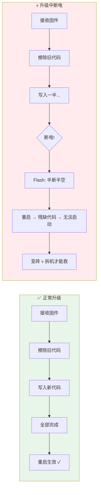
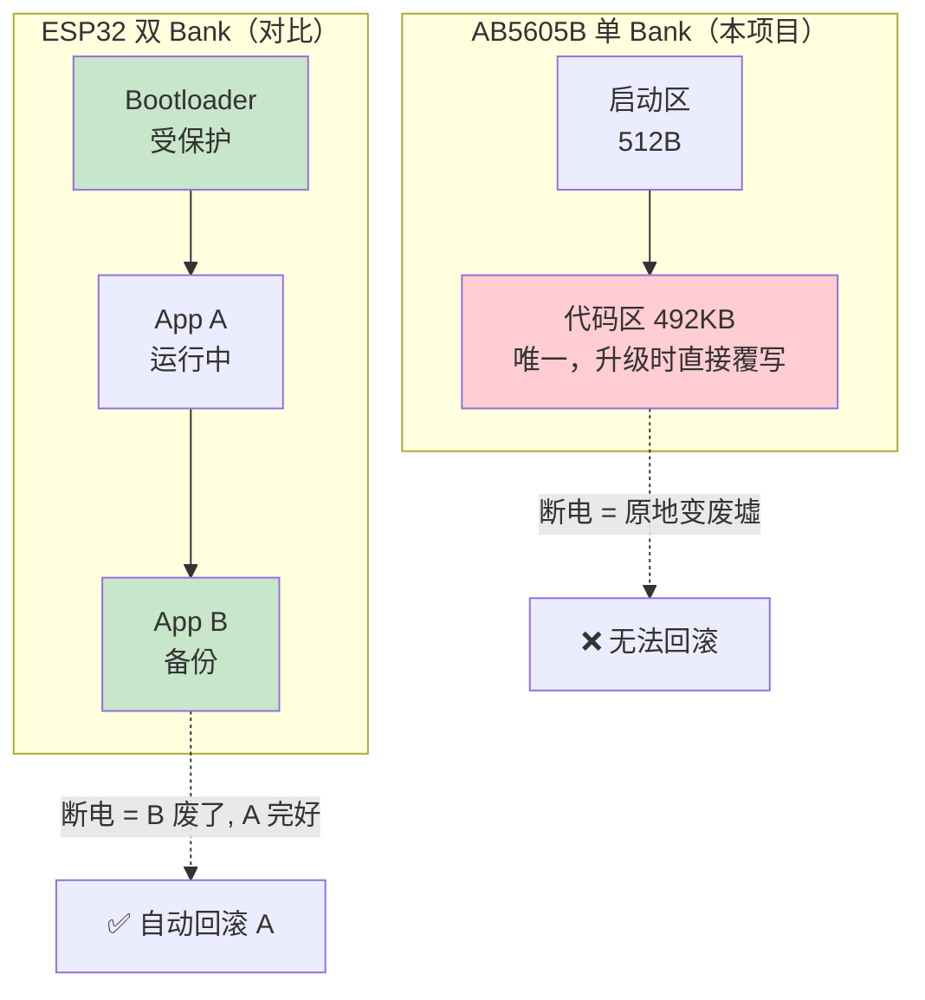
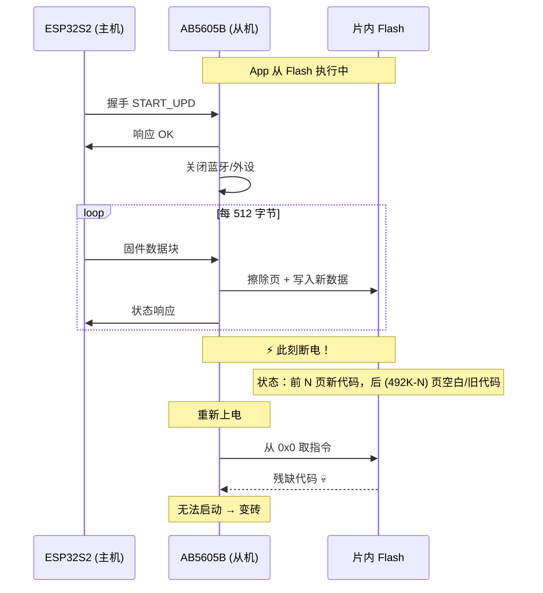
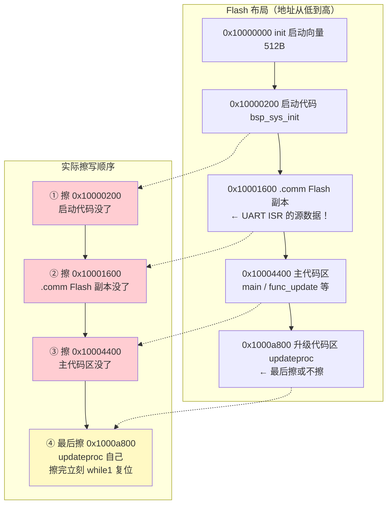
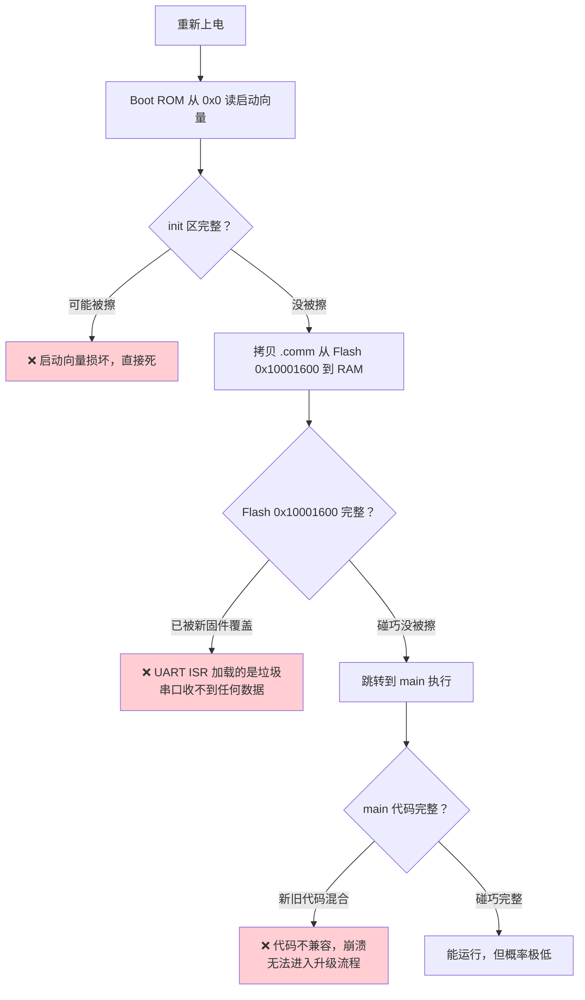
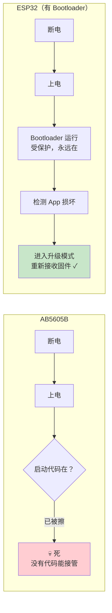

# AB5605B UART 升级风险评估报告

> **一句话结论**：AB5605B 是单 Bank Flash 芯片，没有独立 Bootloader，升级时是"App 自己擦写自己"。**升级过程中断电 = 变砖**，只能拆机用烧录器恢复。这是硬件架构决定的，软件无法规避。

---

功能需求

✅走A2DP  手机APP可以播放音乐（  SBC解码）
✅AUX模式（外部语音也通过该芯片进行播放），切换AUX模式
✅硬件SPI支持驱动WB2812灯带
✅本地语音播放（MP3/WAV） 10条左右 /一个字1.8KB -估算
❌稳定的OTA （不要单分区 ，要有双备份 版本可回退）

硬件配置

- 串口1  PA7&PA6  
-  IO控制  PA5 
- PB3  下载&log（1500000）串口0 
- 音频输入（AUX模式）  PF2   PA5
- WS2812   PE7 SPIDO   PE6 SPICLK 
- 静音 PE0

## 一、为什么升级会变砖？

### 正常升级 vs 断电变砖



### 根本原因：单 Bank，没有备份



---

## 二、三大核心证据

### 证据 1：Flash 只有一份，没有备份区

**文件**：`projects/standard/config.h:51-52`

```c
#define FLASH_SIZE          FSIZE_512K   // 芯片内置 512KB
#define FLASH_CODE_SIZE     492K         // 程序使用空间（全部用完）
```

**文件**：`projects/standard/ram.ld:18-31`

```c
MEMORY {
    init   : org = __base,          len = 512        // 启动区
    flash  : org = __base + 512,    len = 492K       // ← 唯一代码区，无备份
    comm   : org = 0x14000,         len = 16k        // RAM（非 Flash）
}
```

> 512KB Flash 全部用完，没有空间放第二份固件。双 Bank 需要额外 492KB，物理上不可能。

---

### 证据 2：App 自己擦写自己，没有独立 Bootloader

**文件**：`platform/functions/func_update.c:15-48`

```c
AT(.text.func.update)              // ← 代码放在 Flash，不是 RAM
void func_update(void)
{
    updateproc();                  // ← App 自己擦写自己的 Flash
    while (1);                     // ← 等死，靠 WDT 复位
}
```

**文件**：`platform/modules/app/app_fota/app_fota.c:84-88`

```c
AT(.text.fot.cache)
void app_fota_write(void *buf, u32 addr, u32 len)
{
    fot_write(buf, addr, len);     // ← 直接擦写自身 Flash 代码区
}
```

> `updateproc()` 和 `fot_write()` 是 App 自己的函数，不是独立的 Bootloader。App 运行的同时擦写自己的代码区，一旦中断，Flash 中留下残缺代码。

---

### 证据 3：.map 文件证实升级代码在 Flash 运行


**文件**：`projects/standard/Output/bin/map.txt`

```
# 升级核心函数 updateproc() 的地址（map.txt:5557-5559）
.text.update   0x000000001000a884   0x982   ← 0x1000xxxxx 是 Flash 地址
               updateproc           0x1000af12   ← 升级核心，在 Flash 执行

# UART 中断在 RAM（map.txt:4637-4638）
.com_text.uart 0x000000000001467c   0xae     ← 0x000xxxxx 是 RAM 地址
               uart1_isr                     ← 中断服务，在 RAM 执行

# .comm 段：VMA≠LMA，证明从 Flash 拷贝到 RAM（map.txt:4587）
.comm          0x0000000000014000   0x2e00   load address 0x0000000010001600
```

| 组件 | 运行位置 | 擦 Flash 时 |
|------|---------|------------|
| UART 中断 `uart1_isr` | **RAM** 0x1467c | ✅ 安全 |
| 升级核心 `updateproc()` | **Flash** 0x1000af12 | ⚠️ 危险 |
| 数据缓冲 `.uart_upd_buf` | **RAM** | ✅ 安全 |

> 中断和数据缓冲在 RAM 中安全运行，但 `updateproc()` 自己也在 Flash 中。擦写到自己所在页时断电，连升级代码本身都会残缺。


---

## 三、升级失败时序图



---

## 五、最终结论

| 问题 | 答案 |
|------|------|
| 支持 UART 升级？ | ✅ 支持 |
| 不断电时可靠？ | ✅ 可靠 |
| 升级中断电会变砖？ | ⚠️ **会**（单 Bank 无 Bootloader，App 自擦自写） |
| 变砖后能救吗？ | ❌ **不能**，只能拆机 ISP 烧录器 |
| 能否消除风险？ | ❌ **不能**，硬件架构决定 |

> **建议**：量产产品若要 OTA，必须保证升级期间供电稳定（电池备份 + VUSB 不掉线），并准备好 ISP 烧录器的售后维修预案。若要求"零变砖"，唯一方案是硬件引出 SPI Flash 编程引脚，由 ESP32 直接操作 Flash（AB5605B 不参与）。

---

## 附录：证据索引

| # | 文件 | 行号 | 证明内容 |
|---|------|------|---------|
| 1 | `config.h` | 51-52 | Flash 512K 全部用完 |
| 2 | `ram.ld` | 18-31 | 单 Flash 区，无备份分区 |
| 3 | `func_update.c` | 15-48 | `updateproc()` 自擦自写 |
| 4 | `app_fota.c` | 84-88 | `fot_write()` 直接写 Flash |
| 5 | `map.txt` | 4587 | `.comm` 段 VMA≠LMA（RAM 运行） |
| 6 | `map.txt` | 4637 | `uart1_isr` 在 RAM (0x1467c) |
| 7 | `map.txt` | 5557 | `updateproc` 在 Flash (0x1000af12) |
| 8 | `升级方案与协议详解.md` | 0.2/0.4/2 节 | 官方确认变砖风险 |

---

## 附：常见疑问解答

### Q1：升级代码在 Flash 执行，断电后上电重新跑升级、ESP32 重发不就行了吗？

**答：不行。升级是按地址从低到高擦写的，启动代码和 UART 中断的 Flash 副本会先被毁掉，重新上电后没有任何代码能接管。**

#### 升级擦写机制（修正版）

**Flash 硬件规则**：CPU 从页 A 执行时可以擦写页 B，但**不能擦写当前正在执行的页**（硬件死锁保护）。所以 `updateproc()` 自己所在的页要么最后擦（擦完立刻 `while(1)` 复位），要么不擦。

**真正的风险在于：擦写其他页时断电**



> **关键修正**：`updateproc()` 所在页（0x1000a800）是**最后擦**的（擦完立刻复位），不会"擦自己正在执行的代码"。但 ①②③ 步擦的是启动代码、`.comm` Flash 副本、主代码区——这些被擦后断电，重新上电就起不来。

#### 重新上电后会发生什么？



#### 三个致命点

| 致命点 | 说明 |
|--------|------|
| ① 启动代码先被毁 | 升级先擦低地址，`bsp_sys_init()` 在 0x10000200，最早被覆盖 |
| ② .comm Flash 副本被毁 | UART ISR 虽在 RAM 运行，但 RAM 数据是从 Flash 0x10001600 拷来的，Flash 副本没了，RAM 里加载的就是垃圾 |
| ③ 主代码区被毁 | `main()` / `func_update()` / 事件处理等都在 0x10004400+，被擦后无法触发 `EVT_UART_UPDATE` 进入升级流程 |

> **注意**：`updateproc()` 自己所在的页（0x1000a800）是最后擦的，擦完立刻复位——这不是变砖的原因。变砖的原因是 ①②③ 步擦毁了启动和通信所需的代码，断电后没有任何代码能接管。

#### 对比：为什么 ESP32 断电后能重试？



> **一句话**：ESP32 断电后能重试，是因为 Bootloader 在受保护区，永远活着。AB5605B 没有 Bootloader，升级把启动代码自己擦了，断电后**没有任何代码能接管**，连串口都收不了数据。
