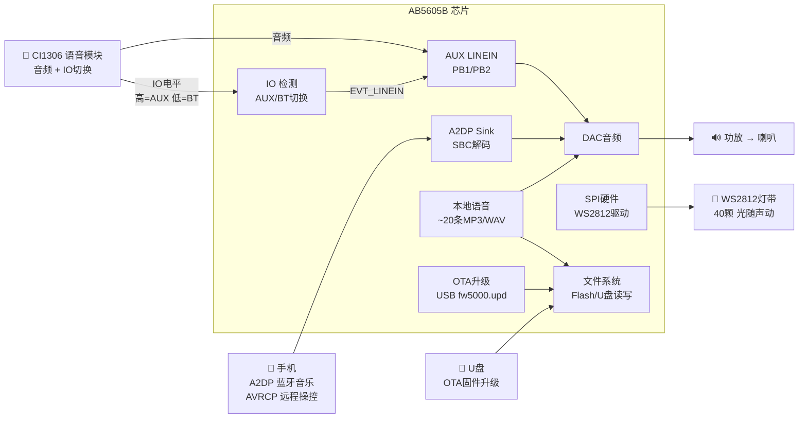
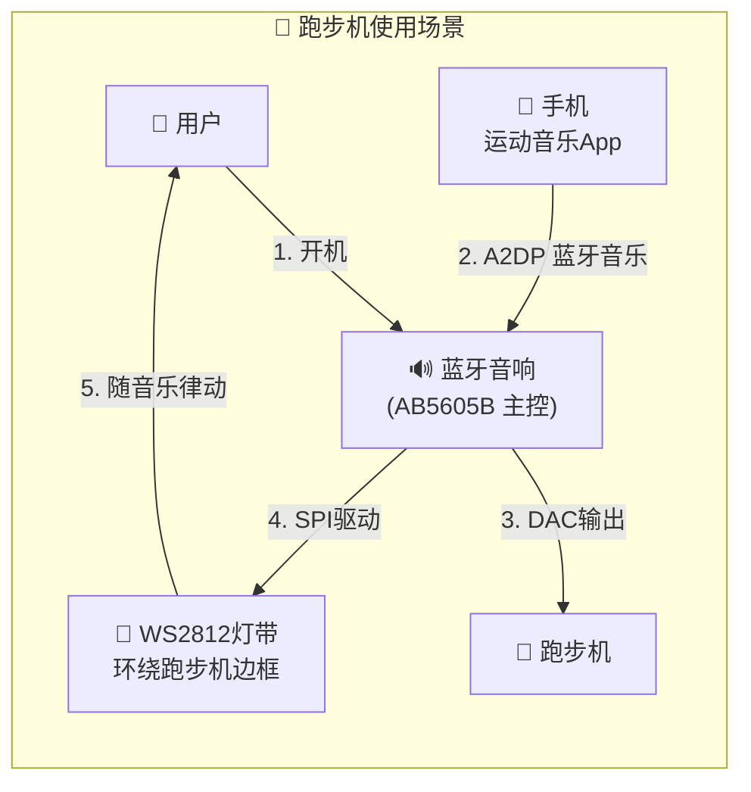
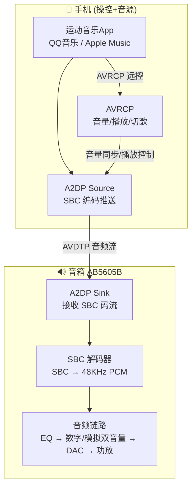
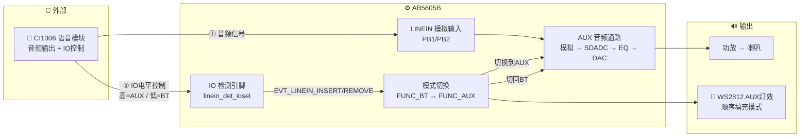
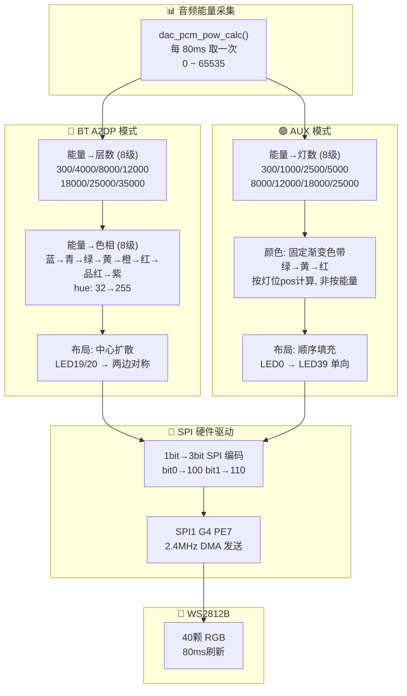
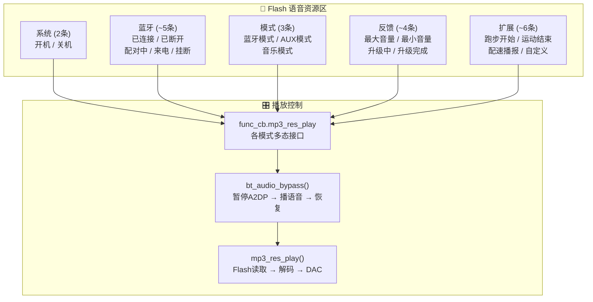
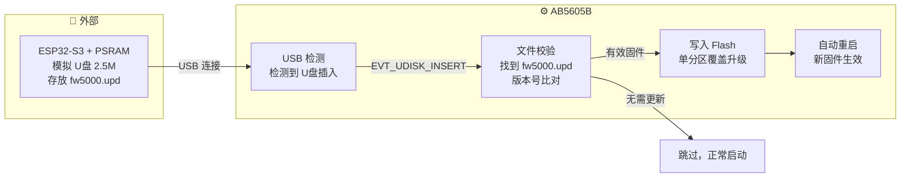
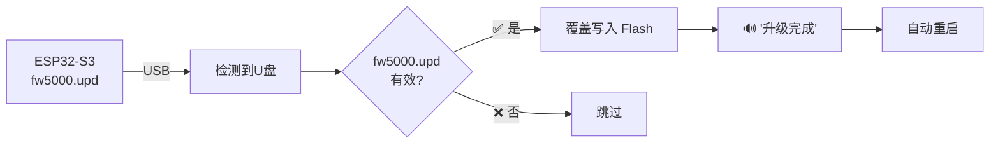

# 4.5 EDR/BR 经典蓝牙 — 产品设计文档

> **产品**: 跑步机蓝牙音响  
> **面向**: 产品经理

---

## 一、系统整体架构

---

## 二、功能点详解

### 2.1 跑步机蓝牙音响 — 产品定位

| 场景特性 | 实现方式 |
|----------|----------|
| 无线束缚 | A2DP 蓝牙音频，手机放口袋即可操控 |
| 高清音质 | SBC 蓝牙解码，48KHz DAC 输出 |
| 运动氛围 | WS2812 灯带随音乐节奏变色律动 |
| 外部音源兼容 | AUX 3.5mm 输入，接跑步机自带音频 |
| 语音反馈 | 内置 ~20 条 MP3/WAV 语音提示 |
| 免维护升级 | USB U盘 OTA 升级，ESP32-S3 模拟U盘 |

---

### 2.2 A2DP 云端音乐 — SBC 高清解码

> **当前**: SBC 编码，手机端 AVRCP 远程操控（非音箱实体按键）

| 编码 | 配置宏 | 码率 | 状态 |
|------|--------|------|------|
| **SBC** | `BT_A2DP_EN = 1` | 328 Kbps | ✅ 当前使用 |
| AAC | `BT_A2DP_AAC_AUDIO_EN = 0` | — | ❌ 未开启 |

> **产品说明**: SBC 是蓝牙音频强制编码标准，所有手机均支持。AVRCP 绝对音量同步已开启 (`BT_A2DP_VOL_CTRL_EN = 1`)，手机端调音量会同步到音箱，反之亦然。所有操控（播放/暂停/切歌/音量）均由手机端完成，音箱不作为独立按键输入设备。

---

### 2.3 AUX 模式 — 外部音源 (CI1306 语音模块)

> **音频源**: CI1306 语音识别模块通过 LINEIN 输入音频  
> **切换方式**: CI1306 通过 IO 口控制 AB5605B 在 BT/AUX 模式间切换

| 特性 | 说明 |
|------|------|
| 音频源 | CI1306 语音识别模块 |
| 音频通路 | LINEIN (PB1/PB2) → SDADC → EQ → DAC → 功放 |
| 切换方式 | CI1306 IO 口输出电平，AB5605B 通过 `linein_det_iosel` 引脚检测 |
| 检测逻辑 | IO 高电平 → LINEIN 在线 → 切换到 AUX 模式 |
| | IO 低电平 → LINEIN 离线 → 切回 BT 蓝牙模式 |
| BT共存 | AUX模式时暂停A2DP，CI1306释放IO后自动回到BT |
| 灯带效果 | AUX 独立灯效：LED0→LED39 顺序填充 |

---

### 2.4 WS2812 灯带 — 硬件 SPI 驱动

> **要求**: 硬件 SPI 驱动 WS2812，不占用 CPU，稳定可靠

#### BT/AUX 双模式对比

| 维度 | 🔵 BT A2DP 模式 | 🟢 AUX 模式 |
|------|-----------------|-------------|
| **能量→LED数映射** | 300→0, 4000→4, 8000→10, 12000→16, 18000→22, 25000→28, 35000→34, ≥35000→40 | 300→0, 1000→5, 2500→10, 5000→15, 8000→20, 12000→25, 18000→30, 25000→35, ≥25000→40 |
| **颜色逻辑** | **随能量变化**: 全灯统一色相，低=蓝(32)→高=紫(255) | **随灯位变化**: 固定绿→黄→红渐变，与能量无关 |
| **布局方式** | 中心扩散: LED19/20 向两端对称亮起 | 顺序填充: LED0 向 LED39 单向点亮 |
| **动态感** | 颜色+数量双维度跟随音乐 | 数量跟随音乐，颜色固定渐变 |

| 技术特性 | 说明 |
|----------|------|
| 接口 | SPI1 G4 映射，PE7(DO) → WS2812 DIN |
| 波特率 | 2.4MHz (120MHz ÷ 50)，3 SPI bit = 1 WS2812 bit = 1.25μs |
| 编码 | 软件预编码 → SPI 硬件自动产时序 → DMA 发送 |
| 刷新 | 80ms 周期，DMA 不关中断不阻塞主循环 |

---

### 2.5 本地语音播放 — ~20 条 MP3/WAV

> **要求**: 内置约 20 条语音提示，MP3/WAV 格式，存储于 Flash

| 资源类型 | 数量 | 格式 | 示例 |
|----------|------|------|------|
| 系统提示 | ~2条 | MP3 | 开机、关机 |
| 蓝牙提示 | ~5条 | MP3 | 已连接、已断开、配对中、来电、挂断 |
| 模式提示 | ~3条 | MP3 | 蓝牙模式、AUX模式 |
| 音量反馈 | ~2条 | MP3 | 最大音量、最小音量 |
| 升级提示 | ~2条 | MP3 | 升级中、升级完成 |
| 跑步专用 | ~6条 | WAV | 跑步开始、运动结束、配速播报等 |
| **合计** | **~20条** | | 每条可独立配置开关 |

> **播放机制**: 提示音播报时暂停 A2DP 音乐通路 → 播放语音 → 恢复音乐通路，用户感知无中断。

---

### 2.6 OTA 固件升级 — USB 单分区升级

> **升级文件**: `fw5000.upd`  
> **升级介质**: ESP32-S3 + PSRAM (2.5M) 模拟 U盘

| 特性 | 说明 |
|------|------|
| 升级文件 | `fw5000.upd` |
| 升级介质 | ESP32-S3 + PSRAM (2.5M) 模拟 U盘 |
| 升级方式 | USB 连接 → 自动检测 → 单分区覆盖写入 |
| 分区方式 | 单分区，升级时直接覆盖固件区 |
| 触发方式 | 开机时检测 U盘中有无 `fw5000.upd` |
| 用户感知 | 语音播报"升级中"→ LED 闪烁 → "升级完成"→ 自动重启 |

#### ⚠️ 单分区风险

| 风险点 | 说明 | 影响 |
|--------|------|------|
| **写入中断 = 变砖** | 升级写入中突然断电，Flash 固件不完整，设备无法启动 | 🔴 高 |
| **无法自动回退** | 没有 A/B 双分区，固件损坏后无备用区可恢复 | 🔴 高 |
| **ESP32-S3 依赖** | 升级依赖外部 ESP32-S3 模拟 U盘，ESP32 故障则无法升级 | 🟡 中 |
| **文件校验失败** | 固件 CRC 不匹配时直接跳过，用户可能未察觉未升级 | 🟡 中 |

> **建议**: 后续条件允许时升级为 A/B 双分区方案，彻底消除"升级变砖"风险。

| 特性 | 说明 |
|------|------|
| 升级文件 | `fw5000.upd` |
| 升级介质 | ESP32-S3 + PSRAM (2.5M) 模拟 U盘 |
| 升级方式 | USB 连接 → 自动检测 → 单分区覆盖写入 |
| 分区方式 | **单分区**，升级时直接覆盖固件区 |
| 触发方式 | 开机时检测 U盘中有无 `fw5000.upd` |
| 用户感知 | 语音播报"升级中"→ LED 闪烁 → "升级完成"→ 自动重启 |

---

## 三、功能配置速查

| 功能点 | 关键配置宏 | 实际值 | 说明 |
|--------|-----------|--------|------|
| **1. 场景** | `FUNC_BT_EN` | 1 | ✅ 蓝牙功能 |
| | `FUNC_AUX_EN` | 1 | ✅ AUX 输入 |
| **2. A2DP** | `BT_A2DP_EN` | 1 | ✅ SBC 解码 |
| | `BT_A2DP_AAC_AUDIO_EN` | 0 | ❌ AAC 未开启 |
| | `BT_A2DP_VOL_CTRL_EN` | 1 | ✅ AVRCP 音量同步 |
| **3. AUX** | `LINEIN_DETECT_EN` | 1 | ✅ 插入自动检测 |
| **4. WS2812** | `RGB_WS2812_EN` | 1 | ✅ 硬件 SPI 驱动 |
| **5. 本地语音** | `WARNING_TONE_EN` | 1 | ✅ 提示音总开关 |
| **6. OTA** | `USB_SD_UPDATE_EN` | 1 | ✅ USB升级 (fw5000.upd) |
| | `UART_S_UPDATE / UART_M_UPDATE` | 0 | ❌ 串口升级未开 |
| | `LE_AB_FOT_EN` | 0 | ❌ BLE OTA 未开 |
| | `BT_AB_FOT_EN` | 0 | ❌ SPP OTA 未开 |
| | 升级介质 | — | ESP32-S3 + PSRAM 2.5M 模拟U盘 |
| **🔌 未使用** | `USER_ADKEY / USER_IOKEY` | 0 | ❌ 无实体按键 |
| | `VBAT_DETECT_EN` | 0 | ❌ 无电池检测 |
| | `CHARGE_EN` | 0 | ❌ 无充电管理 |

---

> 📝 v4.1 | 2026-06-15 | 跑步机蓝牙音响 · 6 功能点 · 对齐代码实测
