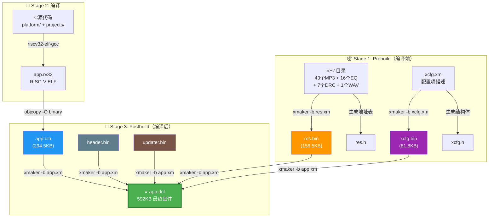

# AB5605B 构建产物与 DCF 文件关系说明

> **适用项目**: `projects/standard`
> **构建目录**: `projects/standard/Output/bin/`

---

## 一、目录文件一览

```
Output/bin/
├── res/                          # 资源源文件目录（xmaker 输入）
│   ├── en/                       # 39个英文语音提示 MP3
│   ├── eq/                       # 8个EQ配置文件 + 1个DRC
│   ├── drc/                      # DRC参数
│   ├── softeq_drc/               # 软件EQ+DRC参数
│   ├── xdrc/                     # XDRC EQ+DRC参数
│   ├── effect/                   # 音效
│   ├── poweron.mp3               # 开机提示音
│   ├── ring.mp3                  # 来电铃声
│   ├── update.mp3                # 升级提示音
│   ├── update_done.mp3           # 升级完成提示音
│   └── max_vol.wav               # 最大音量提示
├── Settings/                     # 上位机配置工具数据
│   ├── Resources/                # 离线资源配置
│   └── Boombox.setting           # 项目设置文件
├── header.bin            (4 KB)  # Flash头部信息
├── header_adc.bin        (4 KB)  # ADC校准头部
├── app.rv32                     # RISC-V ELF可执行文件（编译产物）
├── app.bin             (294.5KB) # 应用程序固件（ELF→bin提取）
├── res.bin             (156.5KB) # 资源打包文件（MP3+EQ+DRC）
├── xcfg.bin            (81.8KB)  # 运行时配置
├── updater.bin          (47 KB)  # OTA升级引导程序
├── updater_擦除记忆区.bin  (47KB) # 升级时清除CM参数区
├── updater_不擦除记忆区.bin(47KB) # 升级时保留CM参数区
├── app.dcf            (592.2KB)  # ⭐ 最终烧录文件
├── app.xm                        # DCF打包脚本
├── res.xm                        # 资源打包脚本
├── xcfg.xm                       # 配置生成脚本
├── download.xm                   # 下载配置脚本
├── prebuild.bat                  # 编译前脚本
├── postbuild.bat                 # 编译后脚本
├── res.h                         # 自动生成的资源地址头文件
├── xcfg.h                        # 自动生成的配置结构体头文件
├── map.txt                       # 链接器Map文件
├── EQ.eqproj                     # EQ工程文件
└── mon_xdrc.*                    # XDRC监控相关
```

---

## 二、构建流程

构建过程分为三个阶段：



### 2.1 Stage 1: Prebuild（编译前）

由 `prebuild.bat` 触发：

```bat
riscv32-elf-xmaker -b res.xm     # 资源打包
riscv32-elf-xmaker -b xcfg.xm    # 配置生成
```

#### `res.xm` 脚本逻辑

```
loadresdir(res);           ← 扫描 res/ 目录下所有文件
makeres(res_buf);          ← 将所有资源打包成二进制块
makeresdef(res.h);         ← 生成资源地址宏定义 → res.h
xcopy(res.h, ../../res.h); ← 拷贝到项目根目录
save(res_buf, res.bin);    ← 保存为 res.bin
```

> **`res.h`** 是自动生成的，定义了每个资源的 Flash 地址和长度，每条占 0x20 字节（8×4），形如：
> ```c
> #define RES_BUF_POWERON_MP3       (*(u32 *)0x11000058)
> #define RES_LEN_POWERON_MP3       (*(u32 *)0x1100005c)
> ```

#### `xcfg.xm` 脚本逻辑

```
depend(0x00090000);                           ← 版本依赖号
config(LEVEL, 0x0F);                          ← 分类层级
config(LIST, "语言选择", ..., LANG_ID, ...);   ← 配置项定义（数百条）
...
config(LEVEL, 0x100);                         ← 结束标记
makecfgfile(xcfg.bin);                        ← 生成配置二进制
makecfgdef(xcfg.h);                           ← 生成配置头文件
xcopy(xcfg.h, ../../xcfg.h);                  ← 拷贝到项目根目录
```

### 2.2 Stage 2: 编译

C 源代码 → RISC-V 工具链编译链接 → `app.rv32` (ELF)

### 2.3 Stage 3: Postbuild（编译后）

由 `postbuild.bat` 触发：

```bat
# 1. ELF → 纯二进制
riscv32-elf-objcopy -O binary app.rv32 app.bin

# 2. 打包 → app.dcf（最终固件）
riscv32-elf-xmaker -b app.xm

# 3. 生成下载配置
riscv32-elf-xmaker -b download.xm
```

#### `app.xm` 脚本逻辑（解码后）

```c
#include "config.h"

// 设置芯片唯一ID
setid(11111111-1111-1111-1111-111111111111);

// 设置Flash参数（从config.h读取宏）
setflash(1, FLASH_SIZE, FLASH_ERASE_4K, FLASH_DUAL_READ, FLASH_QUAD_READ);

// 设置参数区大小
setspace(0x5000);

// 拼接所有bin文件 → dcf_buf
make(dcf_buf, header.bin, app.bin, res.bin, xcfg.bin, updater.bin);

// 保存为app.dcf
save(dcf_buf, app.dcf);
```

---

## 三、各 .bin 文件详述

### 3.1 `header.bin` — Flash 头部信息

| 属性 | 值 |
|------|-----|
| 大小 | 4 KB |
| 来源 | SDK 工具预生成 |
| 内容 | 芯片型号、Flash 参数（大小/擦除粒度/读写模式）、固件版本、签名信息、分区表偏移 |
| 作用 | 上位机/烧录工具根据此头部判断芯片类型和 Flash 布局 |

### 3.2 `app.bin` — 应用程序固件

| 属性 | 值 |
|------|-----|
| 大小 | ~294.5 KB |
| 来源 | `app.rv32` 经 `objcopy -O binary` 提取 |
| 内容 | `.text`（代码）、`.rodata`（只读数据）、`.data` 初始值 |
| Flash 地址 | **0x10000000** |

### 3.3 `res.bin` — 资源打包文件

| 属性 | 值 |
|------|-----|
| 大小 | ~156.5 KB |
| 来源 | `xmaker` 打包 `res/` 目录 |
| 内容 | 资源索引表 + 所有资源数据 |

**包含的资源：**

| 类型 | 数量 | 示例 |
|------|------|------|
| MP3 提示音 | 43个 | `poweron.mp3`, `ring.mp3`, `en/connected.mp3`... |
| EQ 配置 | 16个 | `normal.eq`, `rock.eq`, `pop.eq`, `jazz.eq`... |
| DRC 参数 | 7个 | `normal.drc`, `ver3.drc`, XDRC 系列... |
| WAV | 1个 | `max_vol.wav` |
| 音效 | 1个 | `effect/mon_xdrc.bin` |

**`res.bin` 内部结构：**

```
┌──────────────────────┐  offset 0
│   资源索引表          │  每条 8×4=32 Bytes（ptr + len）
│   RES_BUF_MAX_VOL    │  → 指向 max_vol.wav
│   RES_BUF_POWERON    │  → 指向 poweron.mp3
│   ...                │
│   RES_BUF_XDRC_PRE   │  → 指向 pre.eq
├──────────────────────┤
│   实际资源数据区      │
│   max_vol.wav 数据   │
│   poweron.mp3 数据   │
│   ring.mp3 数据      │
│   ...                │
│   pre.eq 数据        │
└──────────────────────┘
```

Flash 加载地址：**0x11000000**（资源索引区首地址）

### 3.4 `xcfg.bin` — 运行时配置

| 属性 | 值 |
|------|-----|
| 大小 | ~81.8 KB |
| 来源 | `xmaker` 根据 `xcfg.xm` 生成 |
| 内容 | LED 灯效、GPIO 映射、音量曲线、功能开关、IO 初始化表等运行时参数 |

**配置分类（部分）：**
- 系统：语言选择、休眠时间、音量档位
- 音频：MUTE 配置、AB/D 类功放选择、EQ 模式
- 蓝牙：设备名称、配对模式、TWS 配置
- GPIO：按键映射、LED 灯效、充电检测
- 功能：AUX/FM/SD/USB 开关

### 3.5 `updater.bin` — OTA 升级引导

| 属性 | 值 |
|------|-----|
| 大小 | ~47 KB |
| 来源 | SDK 预编译库 |
| 作用 | 固件 OTA 时的二级 Bootloader |

**三个变体：**

| 文件 | 区别 |
|------|------|
| `updater.bin` | 默认版本 |
| `updater_擦除记忆区.bin` | 升级时**清除** CM 参数区（配对信息、音量等恢复出厂） |
| `updater_不擦除记忆区.bin` | 升级时**保留** CM 参数区 |

> **工作原理**：固件 OTA 时，主程序跳转到 updater 代码（部分加载到 RAM 中运行），由 updater 负责擦除并写入新的 `app.bin`。因为 updater 的关键代码段放在 `.com_text*` 段，运行时在 RAM 中，不受 Flash 擦写影响。

### 3.6 `header_adc.bin` — ADC 校准头部

| 属性 | 值 |
|------|-----|
| 大小 | 4 KB |
| 来源 | SDK 工具生成 |
| 作用 | 生产测试/校准流程中的 ADC 参考参数 |

---

## 四、最终产物：`app.dcf`

### 4.1 DCF 文件结构

`app.dcf` 由 `app.xm` 脚本中的 `make()` 命令将 5 个 .bin 文件拼接而成：

```
┌──────────────────────────────┐  ← app.dcf 起始
│                              │
│         header.bin           │  4 KB
│    (芯片信息 + Flash参数)     │
│                              │
├──────────────────────────────┤
│                              │
│          app.bin             │  ~294.5 KB
│    (应用程序固件)            │
│    加载到 0x10000000        │
│                              │
├──────────────────────────────┤
│                              │
│          res.bin             │  ~156.5 KB
│    (MP3 + EQ + DRC 资源包)   │
│    加载到 0x11000000        │
│                              │
├──────────────────────────────┤
│                              │
│         xcfg.bin             │  ~81.8 KB
│    (运行时配置)              │
│                              │
├──────────────────────────────┤
│                              │
│        updater.bin           │  ~47 KB
│    (OTA升级引导)             │
│                              │
└──────────────────────────────┘
         总计 ~592 KB
```

### 4.2 烧录后 Flash 布局

上位机解析 `header.bin` 后，将各段烧写到 NOR Flash 对应地址：

```
NOR Flash 物理布局 (1MB)
┌──────────────────────────┐ 0x10000000
│                          │
│        app.bin           │
│    应用程序固件区         │ ~492KB max
│    (.text + .rodata      │
│     + .data初始值)       │
│                          │
├──────────────────────────┤ 0x1007B000 (实际结束地址)
│                          │
│     CM 参数区            │ 20KB (0x5000)
│  (配对信息/音量/EQ预设)  │
│                          │
├══════════════════════════┤ FLASH_SIZE = 512KB (内置)
│   (512KB以下可能         │
│    有外挂Flash扩展)      │
├══════════════════════════┤ 0x11000000 (资源窗起始)
│                          │
│    资源索引表            │ 每个条目8×4=32Bytes
│    + res.bin 数据        │
│    (MP3/EQ/DRC等)       │
│                          │
├──────────────────────────┤
│     xcfg.bin             │
│    (运行时配置)          │
├──────────────────────────┤
│     updater.bin          │
│    (部分代码进RAM)       │
└──────────────────────────┘
```

---

## 五、文件依赖关系图

```
config.h ────┐
             ├──→ xcfg.xm ──→ xcfg.bin ──┐
             │    (xmaker)    xcfg.h      │
             │                           │
res/ 目录 ──┼──→ res.xm  ──→ res.bin ───┼──→ app.xm ──→ app.dcf ⭐
             │    (xmaker)    res.h       │    (xmaker)
             │                           │
C源代码 ────┼──→ GCC编译 ──→ app.rv32 ──┤
                         objcopy ↓       │
                         app.bin ────────┤
                                         │
              header.bin ────────────────┤
              updater.bin ───────────────┘

图例:
──→  生成关系
⭐   最终产物（上位机烧录文件）
```

---

## 六、关键构建脚本

### `prebuild.bat`（编译前执行）

```bat
@echo off
cd /d %~dp0
@echo on
riscv32-elf-xmaker -b res.xm || goto err
riscv32-elf-xmaker -b xcfg.xm || goto err
exit /b 0
:err
@echo off
if "%1"=="" pause
exit /b 1
```

### `postbuild.bat`（编译后执行）

```bat
@echo off
cd /d %~dp0
set proj_name=app
cd ..\..\
# ↓ 生成 .o 占位文件（依赖标记）
for %%a in ("%cd%") do (
    echo 1 > "%cd%\Output\obj\projects\%%~nxa\ram.o"
    echo 1 > "%cd%\Output\obj\projects\%%~nxa\Output\bin\app.o"
    echo 1 > "%cd%\Output\obj\projects\%%~nxa\Output\bin\download.o"
    echo 1 > "%cd%\Output\obj\projects\%%~nxa\Output\bin\res.o"
    echo 1 > "%cd%\Output\obj\projects\%%~nxa\Output\bin\xcfg.o"
)
cd Output\bin\
@echo on
# 1. ELF → 纯二进制
riscv32-elf-objcopy -O binary %proj_name%.rv32 %proj_name%.bin || goto err
# 2. 打包 → app.dcf
riscv32-elf-xmaker -b app.xm || goto err
# 3. 自动上传（如果安装了烧录工具）
if exist C:\upload\upload.bat (call C:\upload\upload.bat -D AB5600 %proj_name%.dcf)
# 4. 生成下载配置
riscv32-elf-xmaker -b download.xm || goto err
@echo off
exit /b 0
:err
@echo off
if "%1"=="" pause
exit /b 1
```

---

## 七、常见操作对照

### 替换 MP3 提示音

| 步骤 | 操作 |
|------|------|
| 1 | 替换 `res/en/connected.mp3`（注意保持文件名和格式一致） |
| 2 | 运行 `prebuild.bat` → 重新生成 `res.bin` + `res.h` |
| 3 | 运行 `postbuild.bat` → 重新生成 `app.dcf` |
| 4 | 上位机烧录新 `app.dcf` |

### 修改 LED 灯效

| 步骤 | 操作 |
|------|------|
| 1 | 用上位机配置工具修改 `Settings/Boombox.setting` |
| 2 | 导出 → 更新 `config.h` 中对应宏 |
| 3 | 运行 `prebuild.bat` → 重新生成 `xcfg.bin` + `xcfg.h` |
| 4 | 编译 + postbuild → 烧录新 `app.dcf` |

### 修改蓝牙名称

| 步骤 | 操作 |
|------|------|
| 1 | 修改 `config.h` 中 `BT_NAME_DEFAULT` 宏 |
| 2 | 重新编译 + postbuild → 烧录新 `app.dcf` |

---

## 八、总结

| 文件 | 角色 | 生成方式 | 大小 |
|------|------|----------|------|
| `app.rv32` | RISC-V ELF 可执行文件 | GCC 编译链接 | - |
| `app.bin` | 固件纯二进制 | `objcopy` 从 ELF 提取 | 294.5KB |
| `res.bin` | 资源打包 | `xmaker -b res.xm` | 156.5KB |
| `xcfg.bin` | 运行时配置 | `xmaker -b xcfg.xm` | 81.8KB |
| `header.bin` | Flash 头部 | SDK 工具预生成 | 4KB |
| `updater.bin` | 升级引导 | SDK 预编译库 | 47KB |
| **`app.dcf`** | **⭐ 最终烧录文件** | **`xmaker -b app.xm` 拼接** | **592KB** |

> **核心结论**: `app.dcf` 是一个**复合固件容器**，由 `header.bin` + `app.bin` + `res.bin` + `xcfg.bin` + `updater.bin` 五个子文件按序拼接而成。上位机解析 `header.bin` 后，根据地址信息将各段分别写入 NOR Flash 的对应位置。整个构建流程由 `prebuild.bat` → GCC 编译 → `postbuild.bat` 三阶段组成，`xmaker` 工具贯穿始终负责资源打包、配置生成和最终拼装。
