# AB5605B 升级方案与协议详解

### 0.1 什么是真正的 Bootloader

有 Bootloader 的芯片（如 ESP32、STM32）通常是这样的布局：

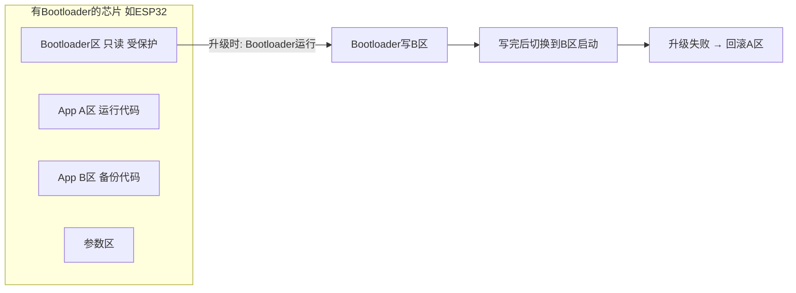
```mermaid
flowchart LR
    subgraph "有Bootloader的芯片 如ESP32"
        A["Bootloader区 只读 受保护"]
        B["App A区 运行代码"]
        C["App B区 备份代码"]
        D["参数区"]
    end
    A -->|"升级时: Bootloader运行"| E["Bootloader写B区"]
    E --> F["写完后切换到B区启动"]
    F --> G["升级失败 → 回滚A区"]
```

Bootloader 的核心特征：
1. **独立于 App**：存在受保护的 Flash 区域，App 损坏不影响 Bootloader
2. **负责升级**：由 Bootloader 执行擦写操作，不是 App 自己写自己
3. **可回滚**：升级失败时 Bootloader 切回旧版本 App

### 0.2 AB5605B 的 FOTA 到底是什么

AB5605B 的 FOTA 代码（`app_fota.c`）只是**蓝牙传输协议层**，负责接收手机发来的固件数据。它运行在 App 内部，不是独立的 Bootloader。

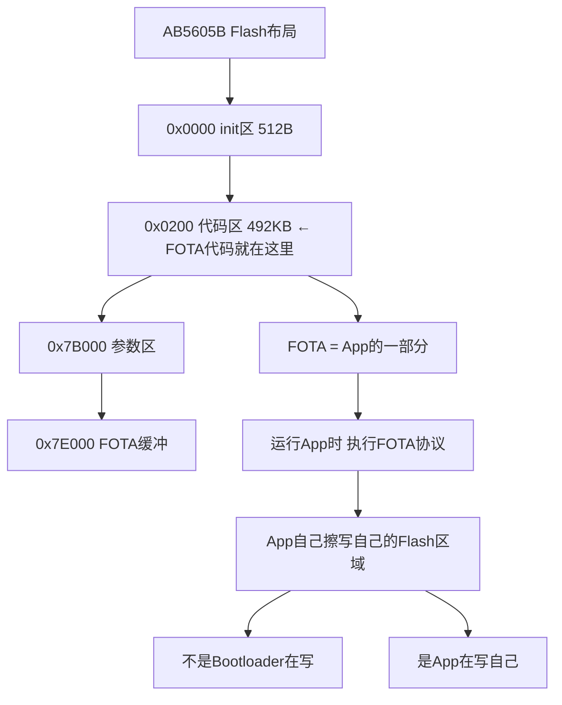
```mermaid
flowchart TD
    A["AB5605B Flash布局"] --> B["0x0000 init区 512B"]
    B --> C["0x0200 代码区 492KB ← FOTA代码就在这里"]
    C --> D["0x7B000 参数区"]
    D --> E["0x7E000 FOTA缓冲"]

    C --> F["FOTA = App的一部分"]
    F --> G["运行App时 执行FOTA协议"]
    G --> H["App自己擦写自己的Flash区域"]
    H --> I["不是Bootloader在写"]
    H --> J["是App在写自己"]
```

从链接脚本 `ram.ld` 可以清楚看到：整个 Flash 从 `0x10000000 + 512` 开始就是代码区，FOTA 代码段 `.fot_data.buf` 和 `.ota_buf*` 都在代码区内部，没有独立的 Bootloader 区域。

### 0.3 关键区别对比

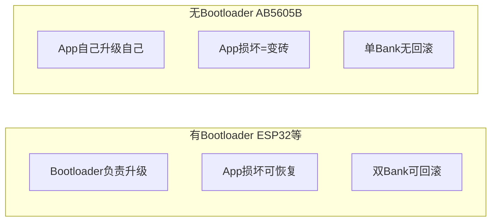
```mermaid
flowchart LR
    subgraph "有Bootloader ESP32等"
        A1["Bootloader负责升级"]
        A2["App损坏可恢复"]
        A3["双Bank可回滚"]
    end
    subgraph "无Bootloader AB5605B"
        B1["App自己升级自己"]
        B2["App损坏=变砖"]
        B3["单Bank无回滚"]
    end
```

### 0.4 FOTA 的实际工作方式

FOTA 在 AB5605B 上的实际运行方式是：App 正常运行 → 收到 FOTA 请求 → App 中的 FOTA 协议代码接收数据 → App 调用 `fot_write()` 直接覆写 Flash 中的代码区。

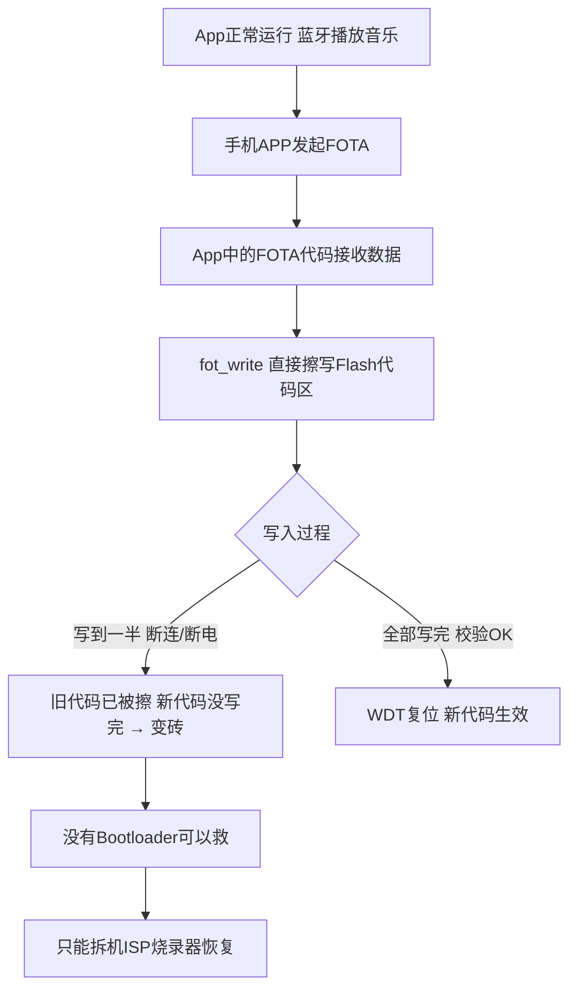
```mermaid
flowchart TD
    A["App正常运行 蓝牙播放音乐"] --> B["手机APP发起FOTA"]
    B --> C["App中的FOTA代码接收数据"]
    C --> D["fot_write 直接擦写Flash代码区"]
    D --> E{"写入过程"}
    E -->|"写到一半 断连/断电"| F["旧代码已被擦 新代码没写完 → 变砖"]
    E -->|"全部写完 校验OK"| G["WDT复位 新代码生效"]

    F --> H["没有Bootloader可以救"]
    H --> I["只能拆机ISP烧录器恢复"]
```

### 0.5 为什么 SDK 提供 FOTA 但不提供 Bootloader

这是芯片设计层面的取舍：
- AB5605B 定位是低成本音频 SoC，512KB Flash 已很紧张
- 双 Bank 需要额外 492KB Flash 空间存放备份，512KB 根本不够
- 独立 Bootloader 需要额外的 Flash 区域和保护机制，增加复杂度
- 芯片厂商的假设是：量产产品很少需要 OTA，出厂烧录即可

**结论**：SDK 中的 FOTA 代码是"传输协议"，不是"安全升级机制"。它提供了接收固件数据的能力，但不提供升级失败后的恢复能力。使用 FOTA 必须接受变砖风险。

---

## 1 升级方案总览

AB5605B 片内 Flash 512KB，单 Bank 设计，无备份区，无 Bootloader。升级时 App 直接覆写自身代码区，任意中断将导致变砖。芯片支持 4 种升级通道，各有优劣。

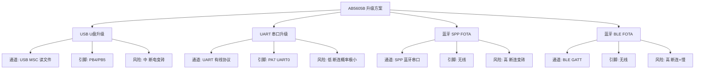
```mermaid
flowchart TD
    A[AB5605B 升级方案] --> B[USB U盘升级]
    A --> C[UART 串口升级]
    A --> D[蓝牙 SPP FOTA]
    A --> E[蓝牙 BLE FOTA]

    B --> B1["通道: USB MSC 读文件"]
    B --> B2["引脚: PB4/PB5"]
    B --> B3["风险: 中 断电变砖"]

    C --> C1["通道: UART 有线协议"]
    C --> C2["引脚: PA7 UART0"]
    C --> C3["风险: 低 断连概率极小"]

    D --> D1["通道: SPP 蓝牙串口"]
    D --> D2["引脚: 无线"]
    D --> D3["风险: 高 断连变砖"]

    E --> E1["通道: BLE GATT"]
    E --> E2["引脚: 无线"]
    E --> E3["风险: 高 断连+慢"]
```

### 方案对比

| 特性 | USB U盘 | UART 串口 | SPP FOTA | BLE FOTA |
|------|---------|-----------|----------|----------|
| 传输通道 | USB MSC | UART0/1 | SPP 蓝牙 | BLE GATT |
| 引脚 | PB4/PB5 | PA7/PA3/PA4 | 无线 | 无线 |
| 波特率 | USB 1.1 FS | 115200 | SPP吞吐 | BLE限制 |
| 断连风险 | 低 | 极低 | 高 | 高 |
| 变砖风险 | 中（断电） | 低 | 高 | 高 |
| 断点续传 | 无 | 无 | 有 | 有 |
| 上位机难度 | 低（U盘） | 高（协议破解） | 中（需APP） | 中（需APP） |
| 适用场景 | 工厂/ESP32S3 | 有线调试 | 消费级OTA | iOS OTA |

---

## 2 单 Bank 变砖风险

AB5605B 的 Flash 布局决定了所有升级方案都面临同一个根本问题：代码区和升级区是同一块区域。

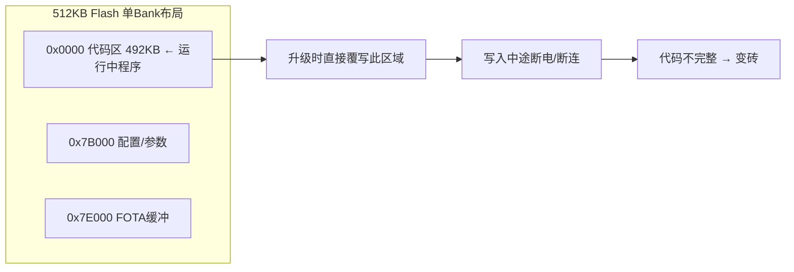
```mermaid
flowchart LR
    subgraph "512KB Flash 单Bank布局"
        A["0x0000 代码区 492KB ← 运行中程序"]
        B["0x7B000 配置/参数"]
        C["0x7E000 FOTA缓冲"]
    end
    A --> D["升级时直接覆写此区域"]
    D --> E["写入中途断电/断连"]
    E --> F["代码不完整 → 变砖"]
```

### 变砖场景

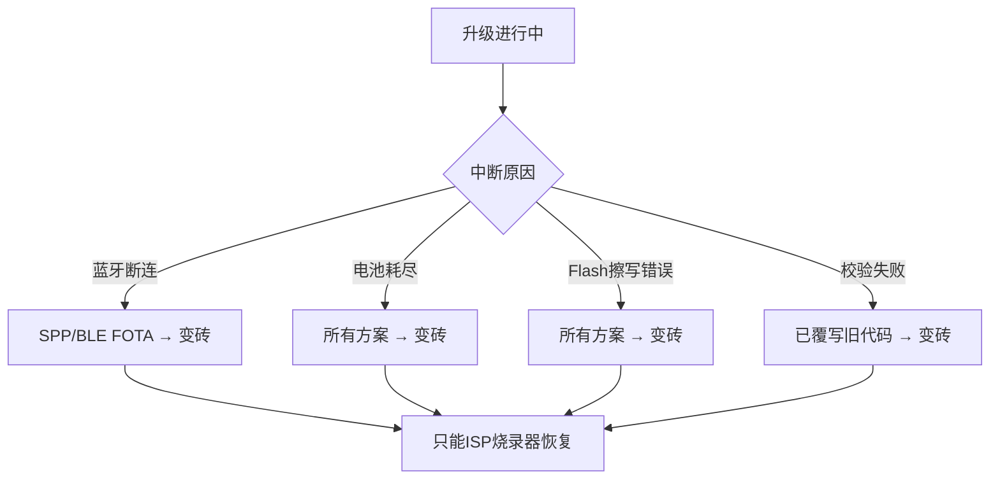
```mermaid
flowchart TD
    A[升级进行中] --> B{中断原因}
    B -->|蓝牙断连| C["SPP/BLE FOTA → 变砖"]
    B -->|电池耗尽| D["所有方案 → 变砖"]
    B -->|Flash擦写错误| E["所有方案 → 变砖"]
    B -->|校验失败| F["已覆写旧代码 → 变砖"]
    C --> G["只能ISP烧录器恢复"]
    D --> G
    E --> G
    F --> G
```

### 与双 Bank 芯片对比

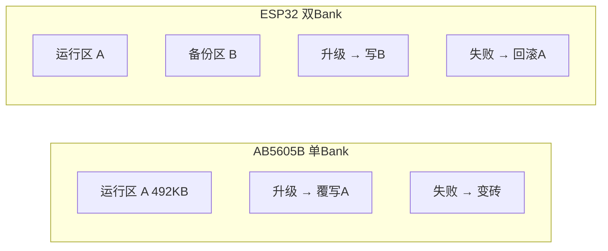
```mermaid
flowchart LR
    subgraph "AB5605B 单Bank"
        A1["运行区 A 492KB"]
        A2["升级 → 覆写A"]
        A3["失败 → 变砖"]
    end
    subgraph "ESP32 双Bank"
        B1["运行区 A"]
        B2["备份区 B"]
        B3["升级 → 写B"]
        B4["失败 → 回滚A"]
    end
```

AB5605B 不支持双 Bank，没有"升级失败回滚"机制。一旦旧代码被擦除，如果新代码没写完，设备就再也无法启动。恢复手段只有拆机用 ISP 烧录器重刷。

---

## 3 USB U盘升级

### 3.1 原理

AB5605B 通过 USB 连接 U 盘，在文件系统中查找升级文件 `fw5000.upd`，找到后读取并覆写 Flash。需要开启 `USB_SD_UPDATE_EN`（本产品已关闭）。

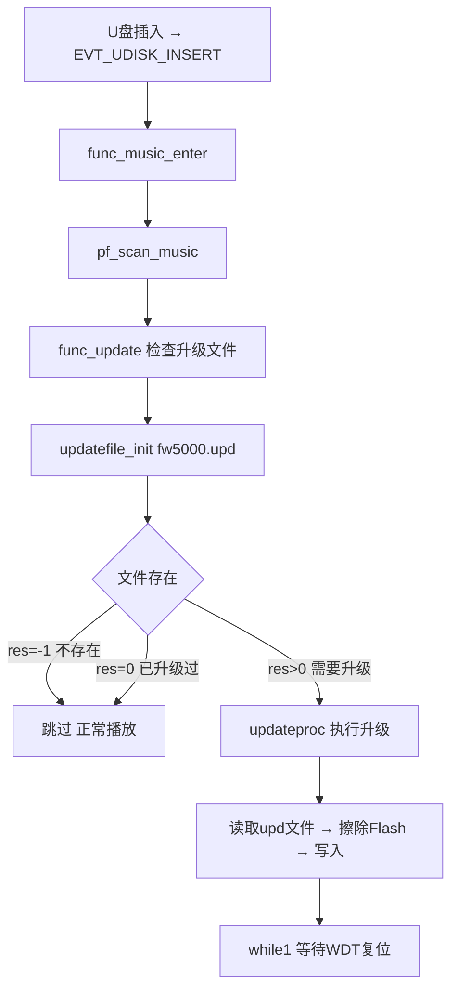
```mermaid
flowchart TD
    A["U盘插入 → EVT_UDISK_INSERT"] --> B["func_music_enter"]
    B --> C["pf_scan_music"]
    C --> D["func_update 检查升级文件"]
    D --> E["updatefile_init fw5000.upd"]
    E --> F{文件存在}
    F -->|res=-1 不存在| G["跳过 正常播放"]
    F -->|res=0 已升级过| G
    F -->|res>0 需要升级| H["updateproc 执行升级"]
    H --> I["读取upd文件 → 擦除Flash → 写入"]
    I --> J["while1 等待WDT复位"]
```

### 3.2 ESP32S3 USB MSC 方案（已验证成功）

使用 ESP32S3R16R8 模拟 USB U 盘，AB5605B 通过 USB 读取 ESP32S3 中的升级文件。

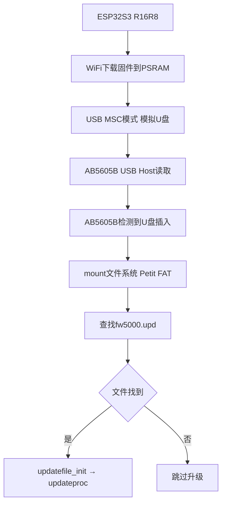
```mermaid
flowchart TD
    A[ESP32S3 R16R8] --> A1["WiFi下载固件到PSRAM"]
    A1 --> A2["USB MSC模式 模拟U盘"]
    A2 --> A3["AB5605B USB Host读取"]

    A3 --> B["AB5605B检测到U盘插入"]
    B --> C["mount文件系统 Petit FAT"]
    C --> D["查找fw5000.upd"]
    D --> E{文件找到}
    E -->|是| F["updatefile_init → updateproc"]
    E -->|否| G["跳过升级"]
```

### 3.3 ESP32S3 PSRAM 资源瓶颈

ESP32S3R16R8 的 8MB PSRAM 在 USB MSC 方案下被全部占用，导致主控无法运行其他功能。

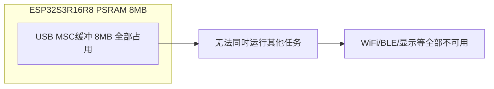
```mermaid
flowchart LR
    subgraph "ESP32S3R16R8 PSRAM 8MB"
        A["USB MSC缓冲 8MB 全部占用"]
    end
    A --> B["无法同时运行其他任务"]
    B --> C["WiFi/BLE/显示等全部不可用"]
```

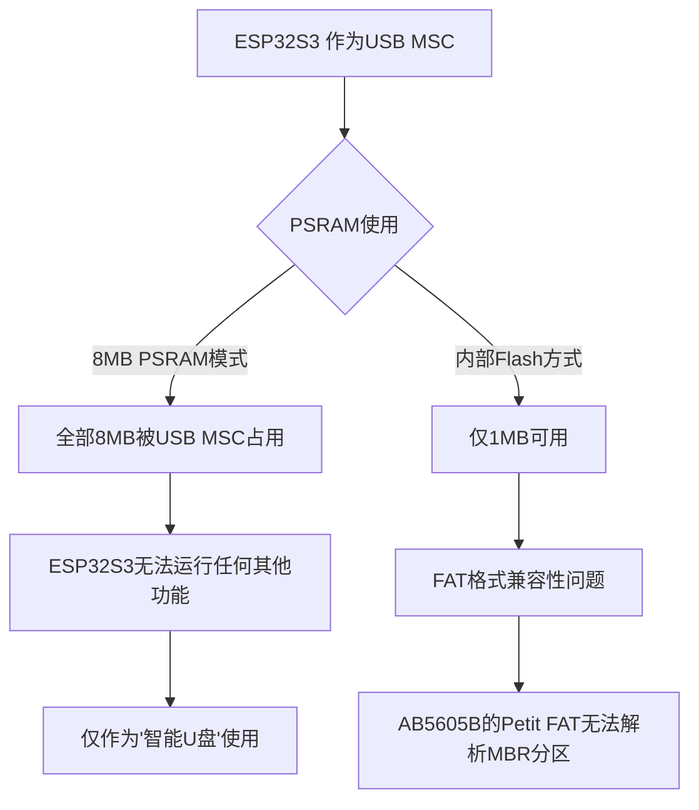
```mermaid
flowchart TD
    A["ESP32S3 作为USB MSC"] --> B{PSRAM使用}
    B -->|"8MB PSRAM模式"| C["全部8MB被USB MSC占用"]
    C --> D["ESP32S3无法运行任何其他功能"]
    D --> E["仅作为'智能U盘'使用"]
    B -->|"内部Flash方式"| F["仅1MB可用"]
    F --> G["FAT格式兼容性问题"]
    G --> H["AB5605B的Petit FAT无法解析MBR分区"]
```

**核心矛盾**：ESP32S3 用 PSRAM 做 USB MSC 时 8MB 全部被占，作为主控无法做其他事；用内部 Flash（1MB）做 USB MSC 时，AB5605B 的 Petit FAT 无法解析 MBR 分区表（只支持超级软盘格式），导致 `updatefile_init()` 返回 -1。

### 3.4 FAT 兼容性问题

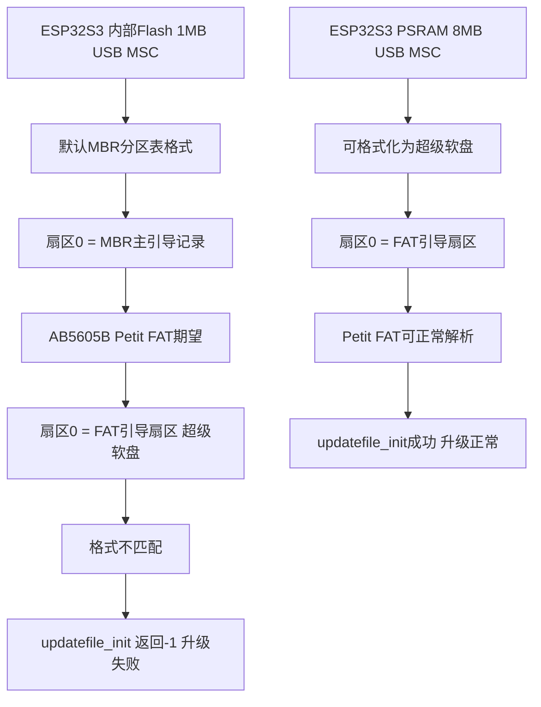
```mermaid
flowchart TD
    A["ESP32S3 内部Flash 1MB USB MSC"] --> B["默认MBR分区表格式"]
    B --> C["扇区0 = MBR主引导记录"]
    C --> D["AB5605B Petit FAT期望"]
    D --> E["扇区0 = FAT引导扇区 超级软盘"]
    E --> F["格式不匹配"]
    F --> G["updatefile_init 返回-1 升级失败"]

    A2["ESP32S3 PSRAM 8MB USB MSC"] --> B2["可格式化为超级软盘"]
    B2 --> C2["扇区0 = FAT引导扇区"]
    C2 --> D2["Petit FAT可正常解析"]
    D2 --> E2["updatefile_init成功 升级正常"]
```

**结论**：如果要让 ESP32S3 用内部 Flash（1MB）做 USB 升级，必须将其格式化为超级软盘模式（无 MBR 分区表），但这需要 ESP32S3 端自定义 USB MSC 的分区表实现。

---

## 4 UART 串口升级

### 4.1 原理

AB5605B 内置 UART 从机升级协议（`UART_S_UPDATE`），ESP32S3 作为主机通过串口发送升级命令和数据。PA7 为 UART0 TX 引脚，可复用为升级通道。

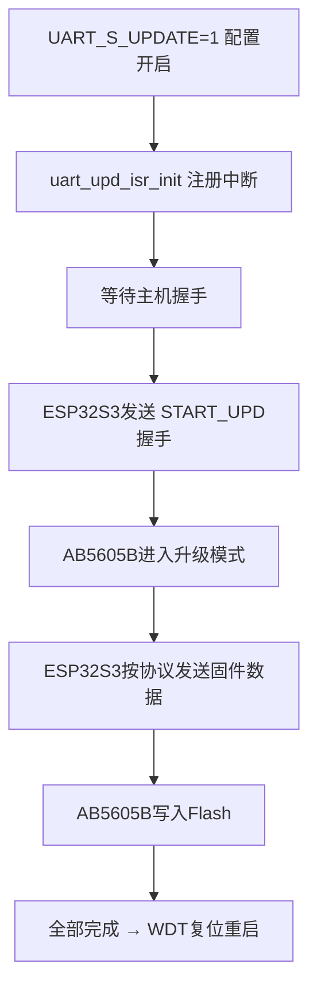
```mermaid
flowchart TD
    A["UART_S_UPDATE=1 配置开启"] --> B["uart_upd_isr_init 注册中断"]
    B --> C["等待主机握手"]
    C --> D["ESP32S3发送 START_UPD握手"]
    D --> E["AB5605B进入升级模式"]
    E --> F["ESP32S3按协议发送固件数据"]
    F --> G["AB5605B写入Flash"]
    G --> H["全部完成 → WDT复位重启"]
```

### 4.2 UART 协议流程

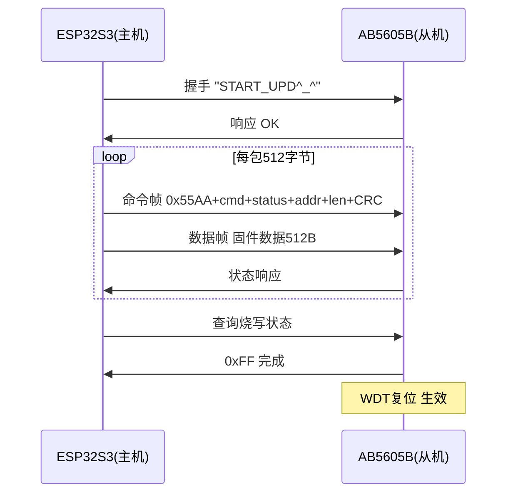
```mermaid
sequenceDiagram
    participant ESP as ESP32S3(主机)
    participant AB as AB5605B(从机)

    ESP->>AB: 握手 "START_UPD^_^"
    AB->>ESP: 响应 OK

    loop 每包512字节
        ESP->>AB: 命令帧 0x55AA+cmd+status+addr+len+CRC
        ESP->>AB: 数据帧 固件数据512B
        AB->>ESP: 状态响应
    end

    ESP->>AB: 查询烧写状态
    AB->>ESP: 0xFF 完成

    Note over AB: WDT复位 生效
```

### 4.3 UART 协议帧结构

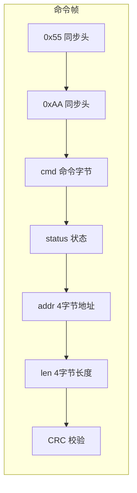
```mermaid
flowchart LR
    subgraph "命令帧"
        A1["0x55 同步头"]
        A2["0xAA 同步头"]
        A3["cmd 命令字节"]
        A4["status 状态"]
        A5["addr 4字节地址"]
        A6["len 4字节长度"]
        A7["CRC 校验"]
    end
    A1 --> A2 --> A3 --> A4 --> A5 --> A6 --> A7
```

### 4.4 上位机破解难度

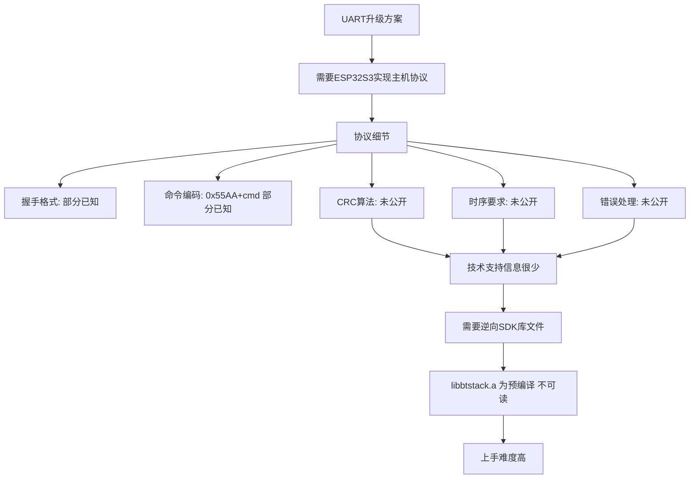
```mermaid
flowchart TD
    A["UART升级方案"] --> B["需要ESP32S3实现主机协议"]
    B --> C["协议细节"]
    C --> C1["握手格式: 部分已知"]
    C --> C2["命令编码: 0x55AA+cmd 部分已知"]
    C --> C3["CRC算法: 未公开"]
    C --> C4["时序要求: 未公开"]
    C --> C5["错误处理: 未公开"]

    C3 --> D["技术支持信息很少"]
    C4 --> D
    C5 --> D
    D --> E["需要逆向SDK库文件"]
    E --> F["libbtstack.a 为预编译 不可读"]
    F --> G["上手难度高"]
```

**现状**：SDK 中 `func_uart_upd.c` 提供了部分协议框架，但核心的 CRC 算法、时序要求、错误重传机制等细节未开放，技术支持提供的信息很少。要完整实现 ESP32S3 端的主机协议，需要大量逆向和试错。

### 4.5 PA7 引脚复用冲突

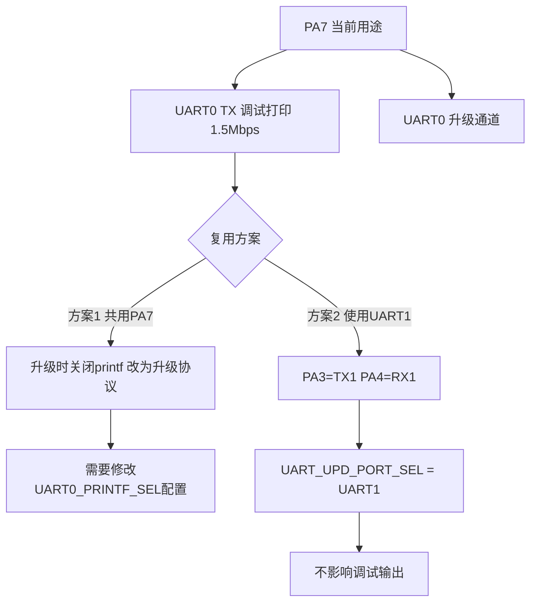
```mermaid
flowchart TD
    A["PA7 当前用途"] --> B["UART0 TX 调试打印 1.5Mbps"]
    A --> C["UART0 升级通道"]

    B --> D{"复用方案"}
    D -->|"方案1 共用PA7"| E["升级时关闭printf 改为升级协议"]
    E --> F["需要修改UART0_PRINTF_SEL配置"]
    D -->|"方案2 使用UART1"| G["PA3=TX1 PA4=RX1"]
    G --> H["UART_UPD_PORT_SEL = UART1"]
    H --> I["不影响调试输出"]
```

---

## 5 蓝牙 FOTA 协议

### 5.1 协议概览

FOTA（Firmware Over The Air）通过蓝牙无线传输固件，支持 SPP（经典蓝牙）和 BLE GATT（低功耗蓝牙）两种通道。需要配套手机 APP。

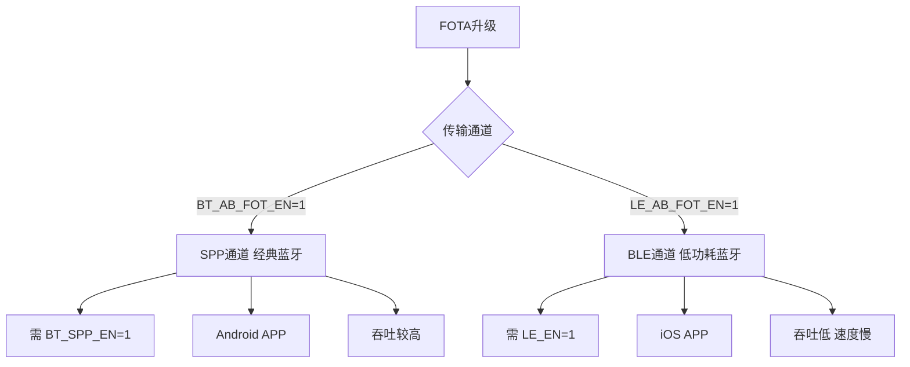
```mermaid
flowchart TD
    A["FOTA升级"] --> B{传输通道}
    B -->|"BT_AB_FOT_EN=1"| C["SPP通道 经典蓝牙"]
    B -->|"LE_AB_FOT_EN=1"| D["BLE通道 低功耗蓝牙"]

    C --> C1["需 BT_SPP_EN=1"]
    C --> C2["Android APP"]
    C --> C3["吞吐较高"]

    D --> D1["需 LE_EN=1"]
    D --> D2["iOS APP"]
    D --> D3["吞吐低 速度慢"]
```

### 5.2 FOTA 认证与连接

APP 需发送 7 字节接入码完成握手认证，设备验证通过后进入 FOTA 模式。

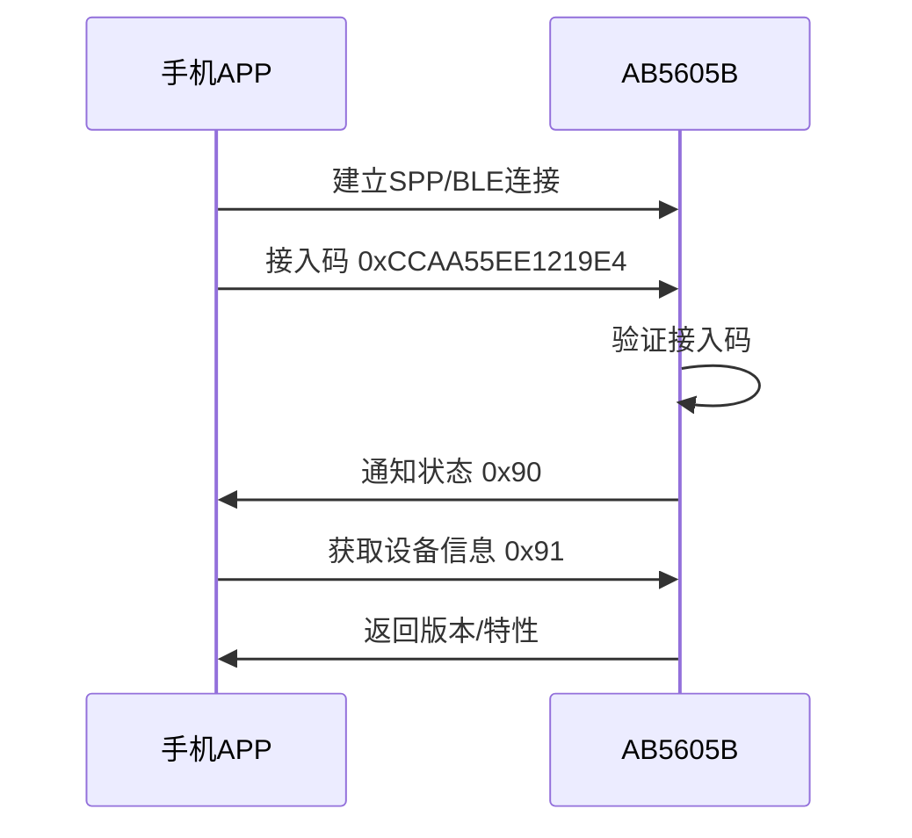
```mermaid
sequenceDiagram
    participant APP as 手机APP
    participant DEV as AB5605B

    APP->>DEV: 建立SPP/BLE连接
    APP->>DEV: 接入码 0xCCAA55EE1219E4
    DEV->>DEV: 验证接入码
    DEV->>APP: 通知状态 0x90
    APP->>DEV: 获取设备信息 0x91
    DEV->>APP: 返回版本/特性
```

### 5.3 FOTA 命令定义

```mermaid
flowchart LR
    subgraph "设备→APP"
        A1["0x90 通知状态"]
        A2["0x91 返回设备信息"]
        A3["0x92 TLV格式信息"]
    end
    subgraph "APP→设备"
        B1["0xA0 数据传输开始"]
        B2["0x20 数据传输续帧"]
    end
```

### 5.4 FOTA 数据帧结构

0xA0 帧为数据起始帧，携带地址和长度；0x20 帧为续帧，只携带数据。

```mermaid
flowchart LR
    subgraph "0xA0 数据起始帧"
        A1["pos0: cmd=0xA0"]
        A2["pos1: seq序列号"]
        A3["pos2-5: addr 4B Flash地址"]
        A4["pos6-9: len 4B 数据长度"]
        A5["pos10+: 固件数据"]
    end
    A1 --> A2 --> A3 --> A4 --> A5

    subgraph "0x20 数据续帧"
        B1["pos0: cmd=0x20"]
        B2["pos1: seq序列号"]
        B3["pos2+: 固件数据"]
    end
    B1 --> B2 --> B3
```

### 5.5 FOTA 完整流程

```mermaid
flowchart TD
    A["APP建立SPP/BLE连接"] --> B["发送7字节接入码认证"]
    B --> C{认证通过}
    C -->|否| D["FOT_ERR_KEY 密钥错误"]
    C -->|是| E["设备通知状态 0x90"]
    E --> F["APP请求设备信息 0x91"]
    F --> G["返回版本号/特性"]
    G --> H["APP发起升级请求 含固件大小+哈希"]
    H --> I["0xA0 数据起始帧 addr+len"]
    I --> J["0x20 数据续帧 固件数据"]
    J --> K{数据传输完成}
    K -->|否| J
    K -->|是| L["CRC校验"]
    L --> M{校验结果}
    M -->|FOT_UPDATE_DONE 0xFF| N["延时3s WDT复位"]
    M -->|FOT_ERR_CRC_VERIFY| O["变砖 需ISP恢复"]
```

### 5.6 FOTA 状态机

```mermaid
flowchart TD
    A["FOT_STA_INIT 初始化就绪"] -->|APP认证成功| B["FOT_STA_START 升级进行中"]
    B -->|APP暂停| C["FOT_STA_PAUSE 暂停"]
    C -->|APP继续| B
    B -->|数据接收完成| D["FOT_FLAG_UPDATE_OK"]
    D --> E["FOT_FLAG_SYS_RESET 系统重启"]
    E --> F["WDT复位 新固件生效"]
```

### 5.7 FOTA 错误码

```mermaid
flowchart TD
    A[FOT_ERR_ENUM] --> B["0x00 OK 成功"]
    A --> C["0x02 KEY 密钥错误"]
    A --> D["0x03 FILE_FORMAT 格式错误"]
    A --> E["0x04 FILE_TAG 标签错误"]
    A --> F["0x05 FILE_DATA 数据错误"]
    A --> G["0x0B CRC_VERIFY 校验错误"]
    A --> H["0x40 SEQ 序列号错误"]
    A --> I["0xFF UPDATE_DONE 完成"]
```

### 5.8 FOTA 断点续传

```mermaid
flowchart TD
    A["FOTA中断 断连/暂停"] --> B["记录已写地址到Flash参数区"]
    B --> C["APP重新连接"]
    C --> D["发送接入码重新认证"]
    D --> E["fot_breakpoint_info_read 读取断点"]
    E --> F["从断点地址继续传输"]
    F --> G["无需重传已完成部分"]
```

断点续传是 FOTA 相比 USB 升级的一个优势，但前提是旧代码尚未被完全覆写——如果升级已进行到中后期，Flash 中代码已不完整，断点续传也无法挽救。

---

## 6 方案选型决策树

```mermaid
flowchart TD
    A[选择升级方案] --> B{是否需要远程OTA}
    B -->|是| C{目标平台}
    C -->|Android| D["SPP FOTA BT_AB_FOT_EN=1"]
    C -->|iOS| E["BLE FOTA LE_AB_FOT_EN=1"]
    D --> F["风险: 无线断连变砖"]
    E --> F

    B -->|否| G{有ESP32S3吗}
    G -->|是| H{ESP32S3资源需求}
    H -->|仅升级| I["USB MSC PSRAM 8M方案"]
    H -->|"升级+其他功能"| J["UART串口升级 PA7"]
    I --> K["已验证成功 PSRAM全占"]
    J --> L["需破解上位机协议"]

    G -->|否| M{工厂量产}
    M -->|是| N["ISP烧录器 最稳妥"]
    M -->|否| O["USB U盘手动升级"]
```

---

## 7 各方案风险与缓解措施

### 7.1 风险矩阵

```mermaid
flowchart TD
    A[升级风险] --> B["断连风险"]
    A --> C["断电风险"]
    A --> D["数据错误风险"]
    A --> E["协议兼容风险"]

    B --> B1["USB: 低 有线连接"]
    B --> B2["UART: 极低 串口直连"]
    B --> B3["FOTA: 高 无线传输"]

    C --> C1["所有方案: 中 需保证供电"]
    C1 --> C2["电池电量>50%才允许升级"]

    D --> D1["USB: Petit FAT兼容性"]
    D --> D2["UART: CRC校验"]
    D --> D3["FOTA: CRC+哈希校验"]

    E --> E1["USB: FAT格式要求超级软盘"]
    E --> E2["UART: 协议细节未完全公开"]
    E --> E3["FOTA: 需专用APP"]
```

### 7.2 缓解策略

```mermaid
flowchart TD
    A[变砖缓解策略] --> B["传输前: 充分准备"]
    A --> C["传输中: 实时校验"]
    A --> D["传输后: 验证确认"]

    B --> B1["电量检查 >50%"]
    B --> B2["信号强度检查 FOTA"]
    B --> B3["固件CRC预校验"]

    C --> C1["每512B做CRC确认 UART"]
    C --> C2["断点续传记录 FOTA"]
    C --> C3["按block擦写 原子操作"]

    D --> D1["全量CRC校验"]
    D --> D2["版本号确认"]
    D --> D3["延时3s才重启"]
```

---

## 8 ESP32S3 + AB5605B 升级方案详细分析

### 8.1 方案一：USB MSC（已验证）

```mermaid
flowchart TD
    A["ESP32S3 R16R8"] --> A1["WiFi下载固件.bin"]
    A1 --> A2["存入PSRAM 8MB"]
    A2 --> A3["USB MSC模式 模拟U盘"]
    A3 --> A4["AB5605B USB Host读取"]

    A4 --> A5["mount Petit FAT"]
    A5 --> A6["查找fw5000.upd"]
    A6 --> A7{文件存在}
    A7 -->|是| A8["updatefile_init → updateproc"]
    A7 -->|否| A9["升级失败"]

    A8 --> A10["读取→擦除→写入Flash"]
    A10 --> A11["WDT复位 新固件生效"]
```

**优势**：AB5605B 端零开发，利用 SDK 原生 USB 升级流程。
**劣势**：ESP32S3 的 8MB PSRAM 全部被 USB MSC 占用，无法同时运行 WiFi、BLE、显示等其他功能，ESP32S3 退化为"智能 U 盘"。

### 8.2 方案二：UART 串口升级

```mermaid
flowchart TD
    A["ESP32S3"] --> A1["WiFi下载固件"]
    A1 --> A2["按UART协议打包"]
    A2 --> A3["串口发送到AB5605B PA7"]

    A3 --> B["AB5605B UART_S_UPDATE"]
    B --> B1["uart_upd_isr_init 等待握手"]
    B1 --> B2["接收START_UPD"]
    B2 --> B3["按协议接收固件数据"]
    B3 --> B4["写入Flash"]
    B4 --> B5["完成 → WDT复位"]

    A2 --> C{"协议实现难度"}
    C -->|"握手格式"| C1["部分已知"]
    C -->|"0x55AA命令帧"| C2["部分已知"]
    C -->|"CRC算法"| C3["未公开 需逆向"]
    C -->|"错误重传"| C4["未公开"]
    C -->|"时序要求"| C5["未公开"]
    C3 --> D["技术支持信息少 破解难度高"]
    C4 --> D
    C5 --> D
```

**优势**：ESP32S3 可同时运行其他功能（WiFi/BLE 等），不独占资源。
**劣势**：UART 协议细节未完全公开，CRC 算法、时序、错误处理需要逆向 SDK 预编译库，开发周期长。

### 8.3 方案三：ESP32S3 USB MSC 内部 Flash

```mermaid
flowchart TD
    A["ESP32S3 内部Flash 1MB"] --> A1["USB MSC模式"]
    A1 --> A2{"FAT格式选择"}
    A2 -->|"MBR分区表 默认"| A3["扇区0=MBR"]
    A3 --> A4["AB5605B Petit FAT无法解析"]
    A4 --> A5["updatefile_init返回-1 升级失败"]

    A2 -->|"超级软盘 自定义"| A6["扇区0=FAT引导"]
    A6 --> A7["Petit FAT可正常解析"]
    A7 --> A8["升级成功"]
    A6 --> A9["需ESP32S3端自定义USB MSC实现"]
    A9 --> A10["开发量中等"]
```

**优势**：不占用 PSRAM，ESP32S3 可同时运行其他功能。
**劣势**：1MB 容量有限；需要自定义 USB MSC 实现为超级软盘格式，ESP32S3 端需额外开发。

### 8.4 方案对比

```mermaid
flowchart LR
    subgraph "USB MSC PSRAM 8M"
        A1["✅ 已验证成功"]
        A2["❌ PSRAM全占 ESP32S3无法做其他事"]
        A3["✅ AB5605B端零开发"]
    end
    subgraph "UART 串口 PA7"
        B1["❌ 上位机协议破解难度高"]
        B2["✅ ESP32S3可同时运行其他功能"]
        B3["❌ 技术支持信息少"]
    end
    subgraph "USB MSC 内部Flash 1M"
        C1["⚠️ 需自定义超级软盘格式"]
        C2["✅ 不占PSRAM"]
        C3["⚠️ 容量有限 1MB"]
    end
```

---

## 9 配置宏速查

| 宏 | 默认值 | 说明 |
|-----|--------|------|
| `USB_SD_UPDATE_EN` | 0 | USB/SD 卡文件升级 |
| `UART_S_UPDATE` | 0 | UART 从机升级（AB5605B 被升级） |
| `UART_M_UPDATE` | 0 | UART 主机升级（AB5605B 升级别人） |
| `BT_AB_FOT_EN` | 0 | SPP 蓝牙 FOTA |
| `LE_AB_FOT_EN` | 0 | BLE 蓝牙 FOTA |
| `UPD_FILENAME` | "fw5000.upd" | USB 升级文件名 |
| `UART_UPD_BAUD` | 115200 | UART 升级波特率 |
| `UART_UPD_PORT_SEL` | UART1_G2_PA3/PA4 | UART 升级引脚选择 |
| `UPDATE_UART_SEL` | UPDATE_UART1 | 升级用 UART 端口 |

---

## 10 建议

1. **开发阶段**：使用 ISP 烧录器，最稳妥。
2. **量产阶段需 OTA**：SPP FOTA（需配套 Android APP），但必须保证传输期间不断连不断电。
3. **ESP32S3 方案**：当前 PSRAM 8M USB MSC 已验证可用，但 ESP32S3 资源全占。若需 ESP32S3 同时承担其他功能，建议尝试方案三（内部 Flash + 超级软盘格式），或投入时间逆向 UART 协议实现方案二。
4. **任何 OTA 方案**：务必在升级前检查电量、提示用户不要操作，并做好变砖后的 ISP 恢复预案。
