# AB5605B 蓝牙音箱软件详细设计-初版

## 1 产品概述

AB560X（RISC-V 32bit, 120MHz, 512KB Flash）+ BR/EDR + BLE 双模蓝牙 + WS2812 灯带律动蓝牙音箱。

核心配置：A2DP 音乐 / AVRCP 控制 / BLE / AUX 线路输入 / WS2812 灯带 / 电池充电 / PWRKEY 软开关机 / 提示音。关闭 HFP / SPP / U盘SD卡 / 录音 / 卡拉OK / FM。蓝牙后台保活（BT_BACKSTAGE_EN）允许 AUX 模式下保持蓝牙连接。


512KB Flash 中 492KB 用于代码和只读数据，末尾约 20KB 为参数存储区（音量、蓝牙配对等）。双线读取 + 加速模式提升取指带宽。

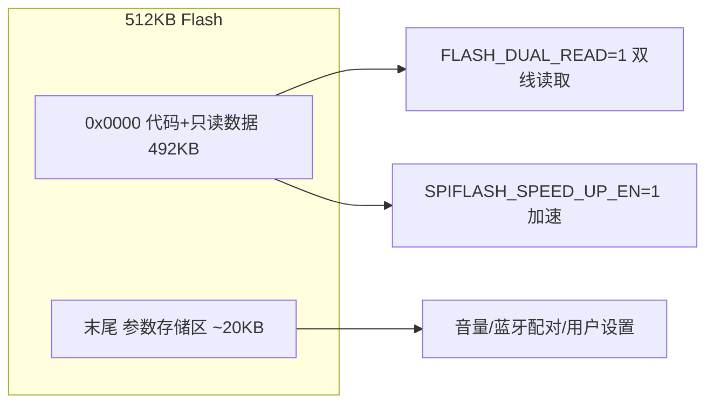


---

## 2 系统启动

芯片上电后从 `main()` 进入 `bsp_sys_init()`，按硬件依赖顺序依次初始化配置、IO、时钟、外设，最后根据外设状态选择初始模式。

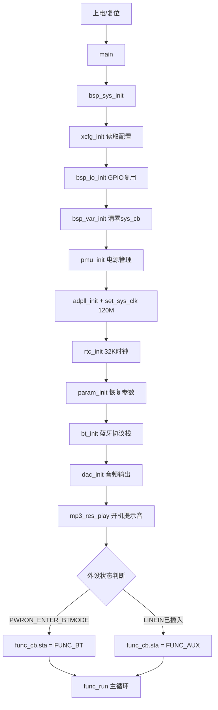

---

## 3 任务调度

系统采用两层循环结构：外层 `func_run()` 的 `while(1)` 负责模式切换，内层每个模式自己的 `while(sta==xxx)` 处理业务逻辑。`func_cb.sta` 被修改后内层循环退出，回到外层 switch 进入新模式。

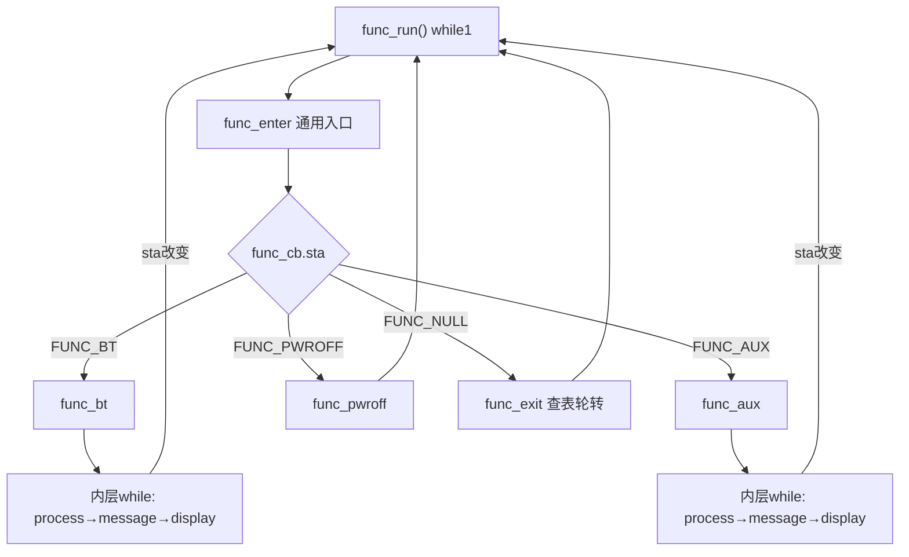

所有模式遵循统一的 enter→process→message→display→exit 五段式结构，添加新模式只需实现这五个函数并注册到 `func_sort_table`。

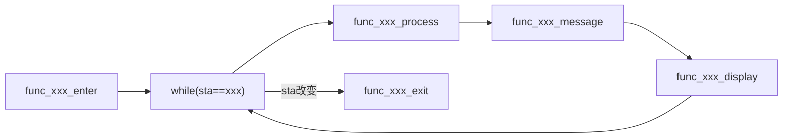

---

## 4 中断与消息驱动

5ms 定时器中断 `usr_tmr5ms_isr()` 是所有检测逻辑的触发源，按不同周期分时执行各项检测，避免 CPU 过载。

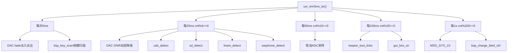

中断中检测到设备状态变化后通过 `msg_enqueue()` 入队事件，主循环 `msg_dequeue()` 取出后分发到当前模式的消息处理函数，由其修改 `func_cb.sta` 触发模式切换。

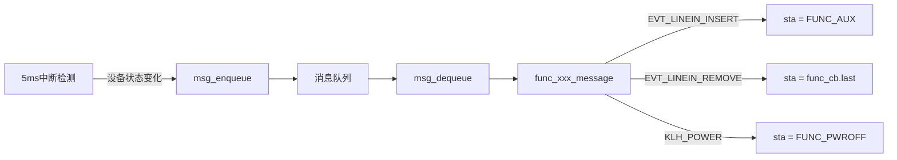

---

## 5 蓝牙模式

### 5.1 蓝牙主循环

蓝牙模式是产品核心，进入后初始化 A2DP 通道并使能 DNR，循环中依次执行公共处理、状态更新、灯带刷新、消息处理和 LED 刷新。退出时根据 BT_BACKSTAGE_EN 决定是否保持连接。

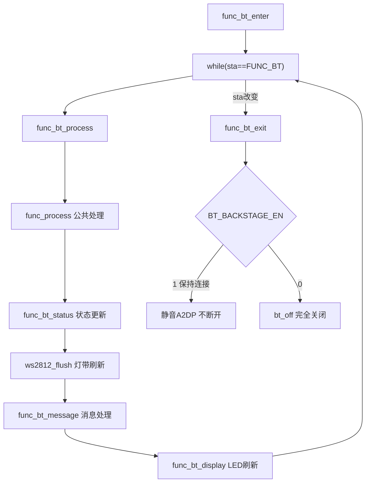

### 5.2 A2DP 音频数据流

手机发送 SBC 编码音频，经基带接收、解码、SRC 转 48K、音量控制、DNR 降噪后从 DAC 输出。同时 DAC 硬件计算音频能量供 WS2812 灯效使用。

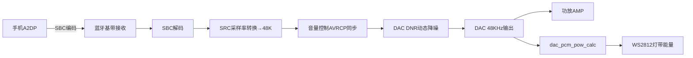

### 5.3 蓝牙连接状态机

上电自动回连 3 次，失败则等待新设备。连接后断线重连 20 次。每个状态对应不同的 LED 闪烁模式，连接成功/断开时播放对应提示音。

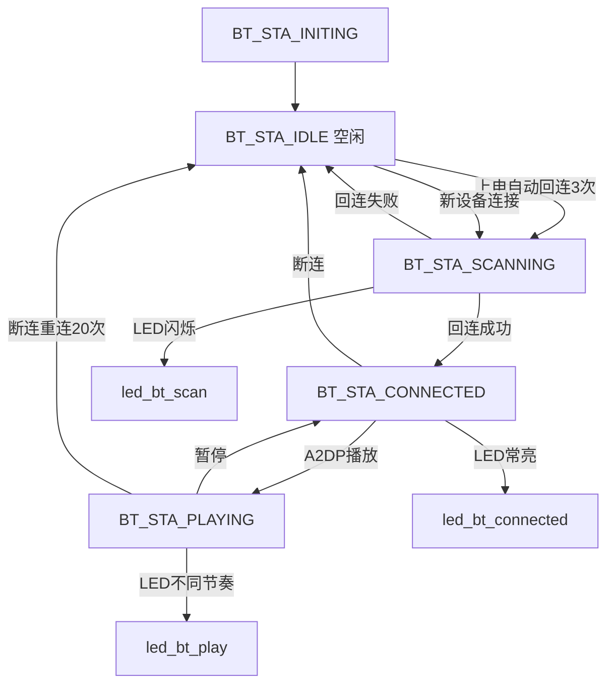

### 5.4 蓝牙后台保活

BT_BACKSTAGE_EN=1 时，LINEIN 插入切 AUX 后不断开蓝牙，仅静音 A2DP 输出。拔出音频线后自动切回蓝牙并恢复播放，无需重新配对。

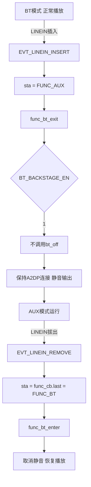

---

## 6 AUX 模式

### 6.1 AUX 音频路径

模拟音频从 LINEIN 引脚输入，经 SDADC 模数转换后送 DAC 输出。ADC 路径便于数字域 EQ 和录音，AUX 模式下关闭 DNR 防止截断语音开头。

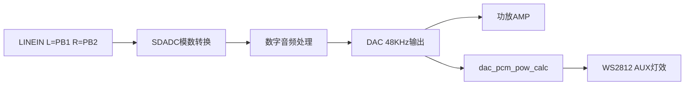

### 6.2 AUX 主循环

进入时初始化 SDADC 并关闭 DNR，旁路蓝牙音频。循环中处理公共任务和灯带刷新，LINEIN 拔出时切回上一模式。

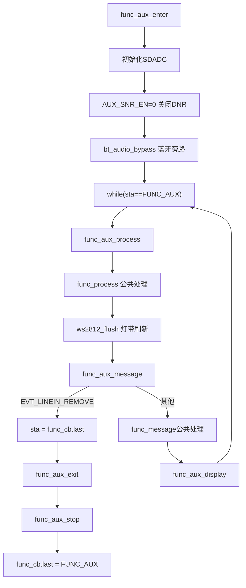

### 6.3 LINEIN 插拔自动切换

5ms 中断中 `linein_detect()` 检测插拔状态变化，插入时切 AUX，拔出时切回上一模式（通常是蓝牙），实现即插即用。

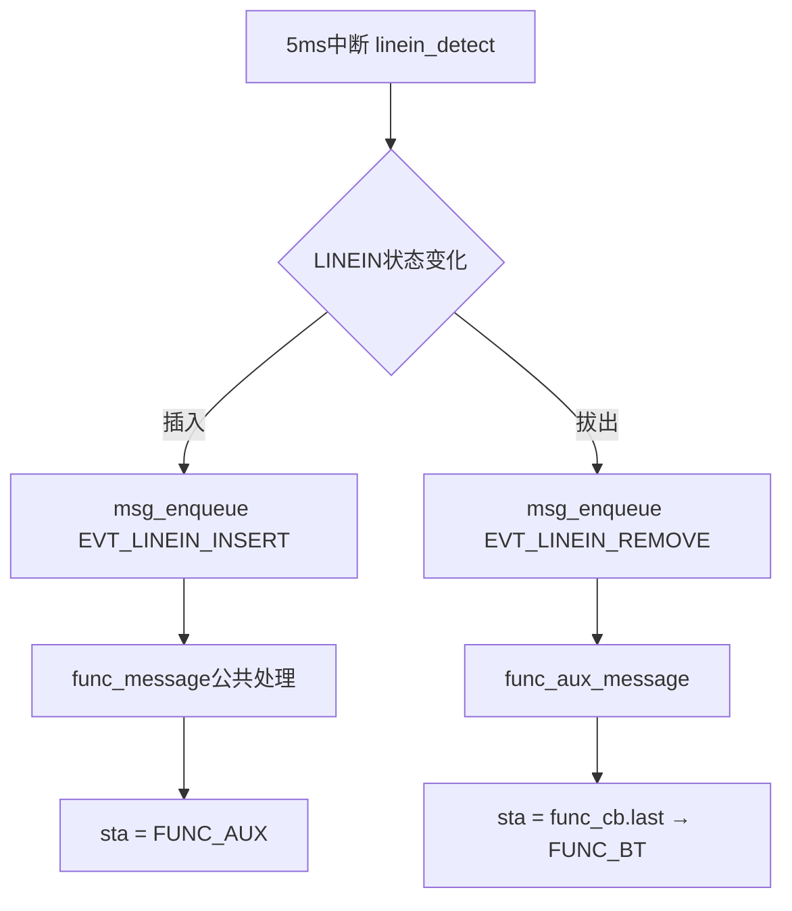

---

## 7 WS2812 灯带

### 7.1 SPI 编码原理

用 SPI 硬件编码代替 GPIO 位翻转，无需关中断。SPI1 = 2.4MHz（120M/50），PE7→DIN。每个 WS2812 bit 编码为 3 个 SPI bit，40 颗 LED 共 360 字节通过 DMA 一次性发送。

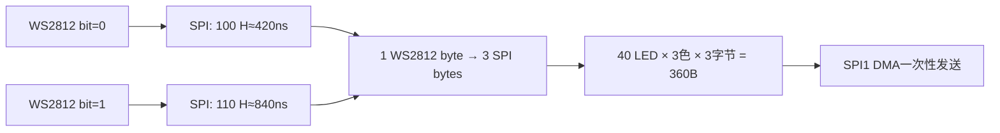

### 7.2 编码流程

`ws2812_encode_byte()` 将 1 字节数据逐位编码：bit=0 拼接 100，bit=1 拼接 110，8 bit 产生 24 bit SPI 值，拆分为 3 字节输出。

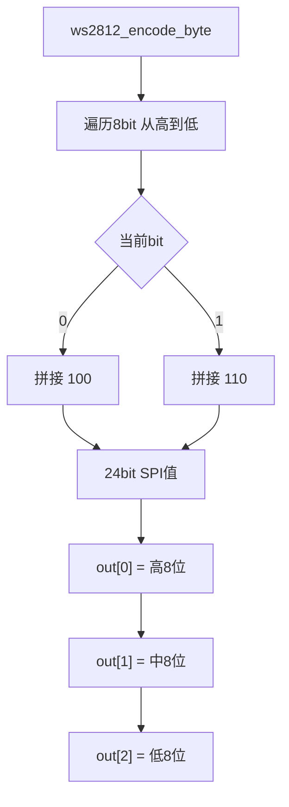

### 7.3 灯效逻辑

`ws2812_flush()` 以 80ms 间隔在主循环调用。BT 已连接时从中心向两边扩散，AUX 模式下顺序填充，其他状态全灭。两种灯效均依赖 DAC 硬件计算的音频能量值。

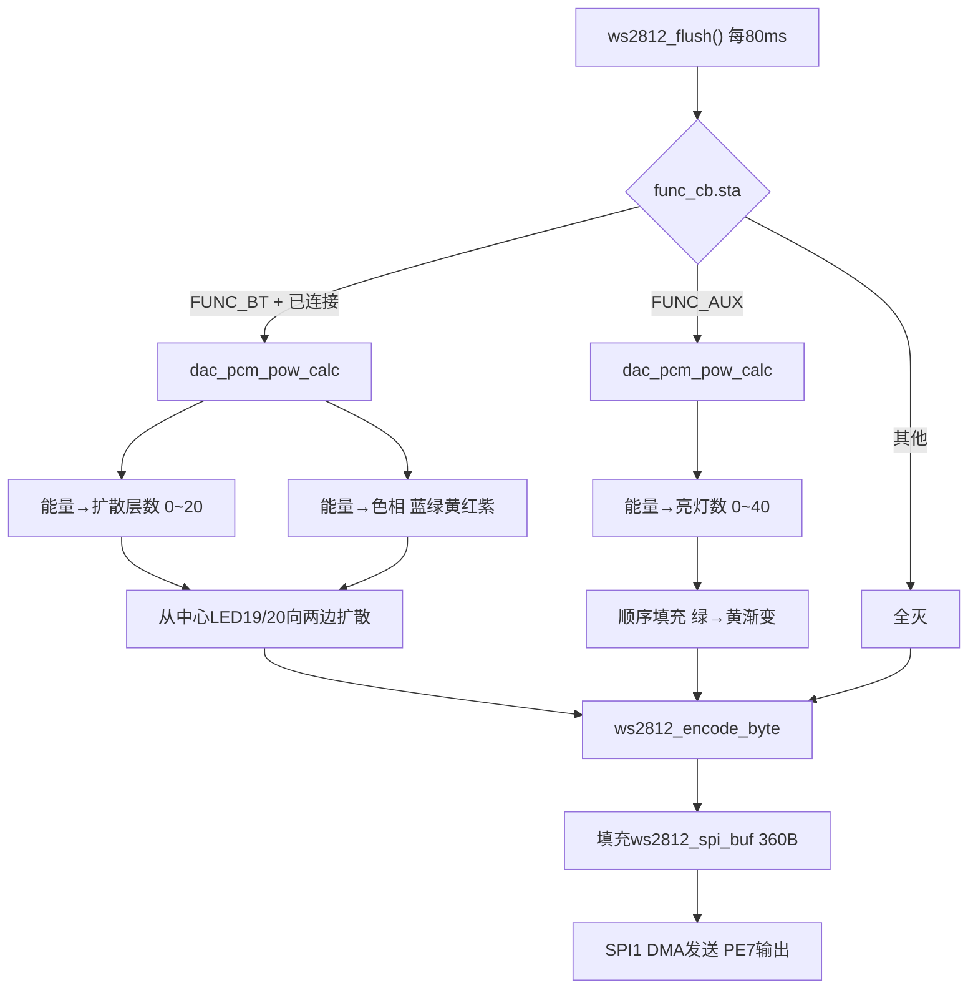

### 7.4 BT模式能量映射

BT 模式下音频能量同时映射为扩散层数和色相：层数决定从中心向外点亮多少颗灯，色相决定整体颜色倾向。音量越大扩散越远、颜色越暖。

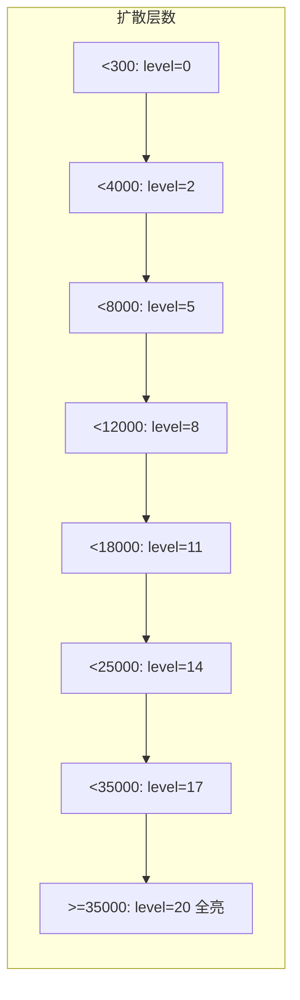

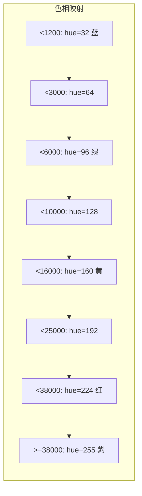

---

## 8 电源管理

### 8.1 电池检测与低电保护

电池电压每 50ms 通过内部 ADC 采样，低于警告值时播放低电提示音并降低音量，持续低于阈值 255 次后强制关机。低于关机阈值则立即关机。

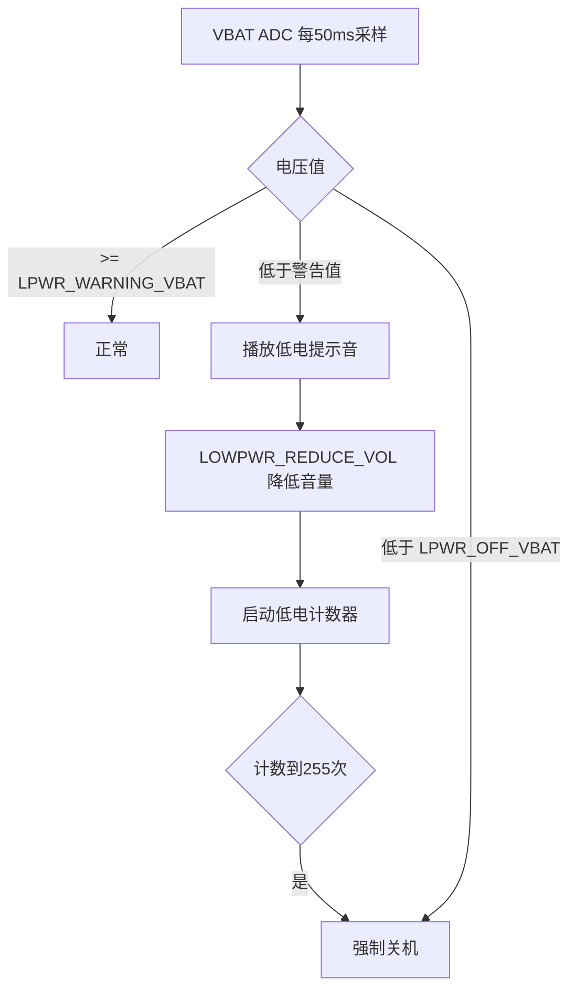

### 8.2 充电管理

片上充电控制器支持三阶段充电：涓流（<2.9V 小电流保护过放电池）→ 恒流（主充电阶段）→ 恒压（电流递减至截止），完成后蓝灯常亮。

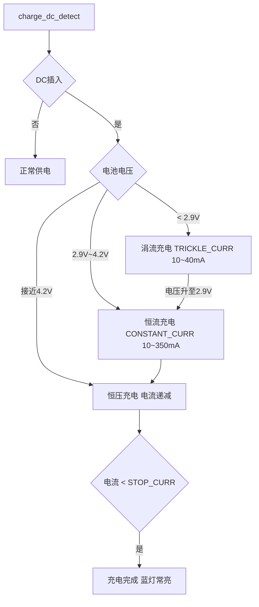

### 8.3 休眠流程

无操作超时后进入蓝牙 Sniff 休眠：关闭大部分外设，时钟降至 26MHz，蓝牙保持低功耗连接。PWRKEY 或蓝牙数据可唤醒，唤醒后恢复所有外设和 120MHz 时钟。

```mermaid
flowchart TD
    A["无操作 > sleep_time"] --> B{bt_is_sleep}
    B -->|false 蓝牙连接中| C[不进休眠]
    B -->|true| D[sfunc_sleep]
    D --> D1[bt_enter_sleep 通知协议栈]
    D1 --> D2[关闭GUI/LED/DAC/DNR/SARADC]
    D2 --> D3[关闭USB 时钟120M→26M]
    D3 --> D4[关闭PLL0/PLL1/PLL2]
    D4 --> D5[保存GPIO 未用引脚→模拟输入]
    D5 --> D6[配置唤醒源 PWRKEY下降沿]
    D6 --> D7["while(bt_is_sleep) bt_sleep_proc"]
    D7 --> E{唤醒事件}
    E -->|PWRKEY按下| F[恢复时钟120M]
    E -->|蓝牙数据到达| F
    F --> G[恢复GPIO/PLL/DAC/SARADC]
    G --> H[返回正常模式]
```

### 8.4 关机流程

长按 PWRKEY 触发关机，保存参数后调用 `sfunc_pwrdown()` 关闭所有电源域并执行 `LPMCON |= BIT(0)` 进入 Power Down，CPU 停止、功耗 μA 级。PWRKEY 或 VUSB 可唤醒，唤醒等同于冷启动。

```mermaid
flowchart TD
    A["长按PWRKEY ≥ 3~6s"] --> B["KLH_POWER消息"]
    B --> C["sta = FUNC_PWROFF"]
    C --> D[func_pwroff]
    D --> D1[LED关机指示]
    D1 --> D2[播放关机提示音]
    D2 --> D3[param_sync 保存参数]
    D3 --> D4[dac_power_off]
    D4 --> D5[saradc_exit]
    D5 --> D6[sfunc_pwrdown]
    D6 --> D7[关闭PLL/26M晶振/模拟LDO]
    D7 --> D8["配置RTC唤醒 PWRKEY/VUSB"]
    D8 --> D9["LPMCON |= BIT(0) Power Down"]
    D9 --> E["CPU停止 功耗μA级"]
    E -->|PWRKEY按下/VUSB插入| F[芯片复位 冷启动]
```

---

## 9 按键与提示音

### 9.1 PWRKEY 按键处理

本产品仅使用 PWRKEY 一个按键，通过 RTCCON BIT19 检测。关机态短按唤醒，运行态长按关机，短按在蓝牙模式下无功能。

```mermaid
flowchart TD
    A["PWRKEY按下 RTCCON BIT19==0"] --> B{当前状态}
    B -->|关机态| C["≥500ms → 唤醒开机"]
    B -->|运行态| D{按下时长}
    D -->|"短按 <3s"| E[蓝牙模式无功能]
    D -->|"长按 ≥3~6s"| F["KLH_POWER → sta=FUNC_PWROFF"]
```

### 9.2 提示音播放

提示音以 MP3 资源存储在 Flash，播放前需旁路蓝牙音频通道，播放完恢复。仅保留开机/关机/连接/断开/低电/最大音量 6 种提示音，其余关闭避免干扰。

```mermaid
flowchart TD
    A[触发提示音事件] --> B[bt_audio_bypass 旁路蓝牙]
    B --> C["mp3_res_play Flash资源播放"]
    C --> D[bt_audio_enable 恢复蓝牙]
```

```mermaid
flowchart LR
    subgraph 已开启
        A[POWER_ON 开机]
        B[POWER_OFF 关机]
        C[BT_CONNECT 连接]
        D[BT_DISCONNECT 断开]
        E[LOW_BATTERY 低电]
        F[MAX_VOLUME 最大音量]
    end
    subgraph 已关闭
        G[BT_WAIT_CONNECT]
        H[BT_PAIR 配对]
        I[FUNC_BT 模式切换]
        J[FUNC_AUX 模式切换]
    end
```

---

## 10 DAC 与音频处理

### 10.1 音频处理链

所有音频经 SRC 统一到 48KHz 后，BT 模式下经 DNR 降噪、AUX 模式下绕过 DNR，最终由 DAC 输出。功放 MUTE 控制在开关机和提示音播放时避免爆音。

```mermaid
flowchart LR
    A[音频输入] --> B[SRC采样率→48K]
    B --> C[音量控制]
    C --> D{DAC_DNR_EN}
    D -->|BT模式| E[DNR动态降噪]
    D -->|AUX模式| F["DNR关闭 AUX_SNR_EN=0"]
    E --> G[DAC输出48KHz]
    F --> G
    G --> H{LOUDSPEAKER_MUTE}
    H -->|UNMUTE| I[功放输出]
    H -->|MUTE| J[静音]
```

### 10.2 MUTE 控制

开机时先 MUTE 功放等 DAC 稳定（30ms）再 UNMUTE 避免爆音；关机/休眠/提示音播放时 MUTE 功放，播放完恢复。

```mermaid
flowchart TD
    A[开机] --> B[MUTE功放]
    B --> C["DAC稳定 30ms后"]
    C --> D[UNMUTE功放]
    E[关机/休眠] --> F[MUTE功放]
    G[提示音播放前] --> H[bt_audio_bypass]
    H --> I[播放完]
    I --> J[bt_audio_enable]
```

---

## 11 IO 资源分配

PA7 调试串口、PB1/PB2 AUX 输入、PE7/PE6 SPI1 驱动 WS2812、PA6 LINEIN 检测，其余 PWRKEY/VBAT/VUSB 使用内部通道。

```mermaid
flowchart LR
    subgraph PA
        PA7["PA7 UART0 TX 1.5Mbps"]
        PA6["PA6 LINEIN检测"]
    end
    subgraph PB
        PB1["PB1 AUX L声道"]
        PB2["PB2 AUX R声道"]
    end
    subgraph PE
        PE7["PE7 SPI1 DO→WS2812 DIN"]
        PE6["PE6 SPI1 CLK 悬空"]
        PE5["PE5 SPI1 DI 未初始化"]
    end
    subgraph 内部
        PK[PWRKEY RTCCON BIT19]
        VB[VBAT 内部ADC]
        VU[VUSB 充电检测]
    end
```

---

## 12 配置依赖与编译裁剪

`config_extra.h` 在编译期根据用户配置自动推导和冲突检查，确保不合法的配置组合无法编译，未使用代码被编译器优化掉。

```mermaid
flowchart TD
    A[config.h 用户配置] --> B[config_extra.h 编译期推导]

    B --> C["FUNC_MUSIC_EN=0"]
    C --> C1[MUSIC_UDISK_EN=0]
    C --> C2[MUSIC_SDCARD_EN=0]
    C --> C3[USB_SD_UPDATE_EN=0]
    C --> C4[所有解码格式=0]

    B --> D["BT_BACKSTAGE_EN=1"]
    D --> D1[FUNC_FMRX_EN=0]

    B --> E["LE_EN=1"]
    E --> E1[BT_DUAL_MODE_EN=1]

    B --> F["SD0_MAPPING=G2"]
    F --> F1[SD_USB_MUX_IO_EN=1]

    B --> G["UART0_PRINTF_SEL=PA7"]
    G --> G1[无冲突 正常编译]
```

## 
